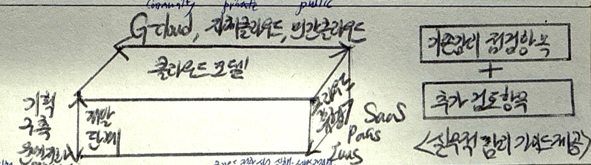

## 클라우드 전환사업 단계별 감리 개념

- 기관이 구축/운영 중인 정보시스템 어플리케이션의 변경 없이 인프라 자원을 대상으로 클라우드로 전환하는 사업에 대한 감리를 수행하여 적정성을 평가

## 클라우드 전환사업 단계별 감리 개념도, 단계별 감리 방법, 클라우드 전환사업 검토항목

### 클라우드 전환사업 단계별 감리 개념도

### 클라우드 전환사업 단계별 감리 방법

#### 클라우드 전환 사업 계획 수립/신청

| 단계 | 활동 | 세부 내용 |
| --- | --- | --- |
| 전환 계획 수립 및 준비 | 전환 타당성 검토 | 클라우드 기반 전환 가능성에 대한 검토 적절성 확인 |
| | 요구사항 및 영향도 분석 | 전환 따른 이해관계자 요구사항, OS 지원 영향도 확인 |
| | 자원 구성, 사용량 확정 | 성능 안정성 확보 위한 자원 점검 및 사용권 확인 |
| | 구축 및 테스트 계획 수립 | 전환에 따른 업무 중단 최소화, 안정성 유지 방안 구축 및 테스트 계획 |
| 전환 실행 | nTOPS 계정 산정 | nTOPS 통합 계정 및 전환 산정 적절성 확인 |
| | 원격접근, 방화벽 방안 산정 | 환경 특성 따른 경로 확인, 방화벽 신청 적절성 검토 |

#### 클라우드 전환 사업 실행/서비스 안정화

| 단계 | 활동 | 세부 내용 |
| --- | --- | --- |
| 클라우드 전환 | APP 수정 개발 | IP 변경, 트래픽 분배 등으로 인한 APP 수정 요구 적정성 확인, 테스트 수행 |
| | APP 원상 복구 설계 | WAS, DB 서버 SW 이관과정의 정상 작동 확인, 연계 SW 영향도 분석 |
| | 클라우드 서비스 이용 환경 구축 | 클라우드 리소스를 효율적으로 활용할 수 있는 환경 설정 확인 |
| | 보안 취약점 점검 | HW, APP 등 지원 위험요인 파악, 취약점 분석 및 대응방안 마련 |
| | 데이터 이관 | 데이터 이관 계획 수립 및 데이터 무결성 검증 확인 |
| | 통합 테스트 수행 | 사용자 환경에서 시나리오 기반 통합 테스트 수행 및 작업 결과 확인 |
| 서비스 안정화 | 서비스 전환 및 안정화 | 안정적 전환을 위한 APP 및 사용 SW 내 예외 기술 지원 여부, 적정 운영 검토 |

### 클라우드 전환사업 검토항목

| 부문 | 점검항목 | 세부 내용 |
| --- | --- | --- |
| 전환 적정성 평가 | 클라우드 전환 가능성 | 정보시스템 특성과 클라우드 환경 간 적합성 검토 |
| | 상용 SW를 공개 SW로 전환 가능 여부 | 현재 상용 SW의 오픈소스 전환 가능성 평가 |
| | 업무단위 이관 가능 여부 | 업무시스템별 클라우드 전환 가능성 검토 |
| 인프라/시스템 분석 | 장비 사용연한 만료 여부 | 장비교체주기 고려한 전환 필요성 검토 |
| | SW 기술지원 만료여부 | SW기술지원 만료상태 확인 |
| | 시스템용랴안정 | CPU, 메모리, 디스크용량 등 시스템자원 산정 |
| | 시스템 구성 | 클라우드 전환을 위한 시스템 구성요소 결정 |
| NW 및 보안 영향성 | 고립망, DR 활용 여부 | 재해복구(DR) 또는 고립망 구성 필요성 검토 |
| | 인터넷과 행정서비스 간 데이터 연동 필요여부 | 내외부간 데이터 동기화 등 데이터 연동 필요성 검토 |
