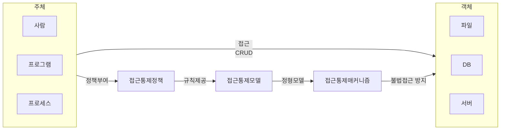
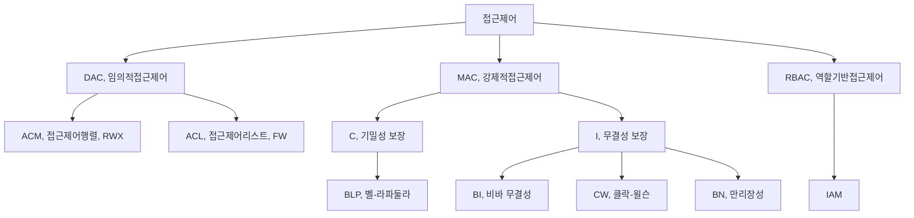
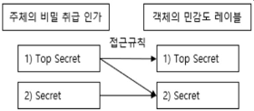
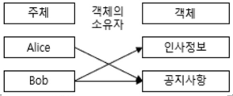

## 접근제어 개념

- 접근 ==제어정책==(Policy), ==메커니즘==(Mechanism), ==모델==(Model)로 구성되어 사용자(주체)의 신원을 식별/인증하여 객체의 접근, 사용수준을 인가하는 기법

## 접근제어 유형

### 접근제어 유형도

### 접근제어 유형 상세설명

| 구분 | 개념도 | 설명 |
| --- | --- | --- |
| MAC, 강제적 |  | 객체별로 정의된 권한을 근거로 접근 제어  군에서 사용, 중앙집중식 |
| DAC, 임의적 |  | 사용자나 그룹에 근거한 접근 제어  소유자의 권한 변경 |
| RBAC, 역할기반 |  |역할에 의한 접근 제어 최소권한, 직무분리, 계층 분리 |

## 강제적 접근 통제 모델

> MAC, Mandatory Access Control

### 벨-라파둘라

- 군사용 보안구조 요구사항 충족을 위해 미국의 벨과 라파둘라가 최초 개발
- 정보의 파괴나 변조보다는 기밀성 유지에 초점
- 극비, 비밀, 미분류로 분류
- ==No Read Up, No Write Down==

### 비바 무결성

- 벨-라파둘라 모델에서 불법 수정방지 내용 추가로 정의한 무결성 모델
- 비인가자의 데이터 수정 방지 기능
- 낮은 비밀등급에서 높은 비밀등급으로 Write 금지함으로 무결성 오염 방지
- ==No Write Up, No Read Down==

### 클락-윌슨

- 상업환경에 적합하게 개발된 불법 수정방지를 위한 접근통제모델로 무결성 방지
- 임무 분리의 원칙
- 상용, 금융, 회계 데이터
- Well-Formed Transactions: ==모든 거래사실 기록==, 구현 복잡

### 비교

| 구분 | 벨-라파둘라 | 비바 | 클락-윌슨 | 만리장성 |
| --- | --- | --- | --- | --- |
| 보호대상 | 기밀성 | 무결성 | 무결성 | 무결성 |
| 특징 | 비인가된 읽기 금지 | 비인가된 기록 금지 | 무결성 보존 | 이해 상충 방지 |
| 분야 | 군사, 정부 | 금융, 의료 | 상업, 금융, 회계 | 정부, 기업 |
| 장점 | 기밀성 | 무결성 | 무결성 및 신뢰성 | 무결성, 정보 흐름 제어 |
| 단점 | 유연성 부족 | 기밀성 부족 | 복잡한 구현  | 복잡한 규칙 |
| 비고 | No Read Up, No Write Down | No Write Up, No Read Down | 무결성 검증 절차 사용 | 명확한 이해관계 정립 필요 |

## 접근제어 고려사항

- 계정이 탈취되는 경우 접근제어로 비밀 보장을 할 수 없으므로, MFA를 활성화하여 보안 강화 필요

## 참조

- [Sprinto: Types of Security Models](https://sprinto.com/blog/types-of-security-models/)
