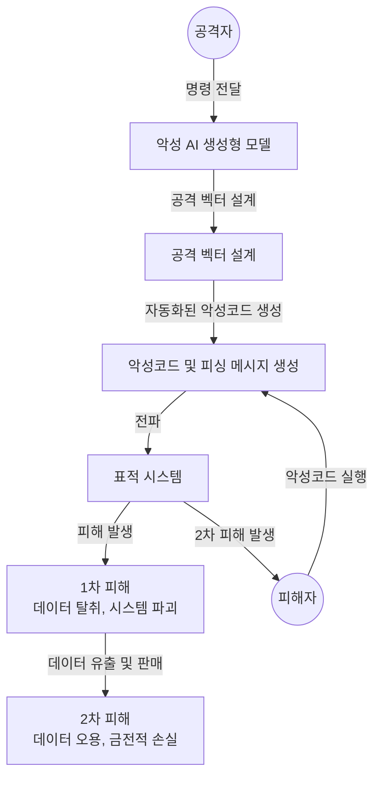

## AI를 이용한 사이버 공격 패러다임 개념

- AI와 ML 기술을 악용해 자동화된 피싱, 정교한 악성코드 생성, 탐지 회피 등을 수행하여 기존 보안 체계를 우회하는 사이버 공격 방식
- AI 기반 공격 도구의 등장, 대규모 데이터 분석과 자동화된 공격 가능, 공격자의 적응적 공격 체계 구축

## AI를 이용한 사이버 공격 개념도, 공격절차, 대응방안

### AI를 이용한 사이버 공격 개념도

- FraudGPT, WormGPT, DarkGPT 등을 활용하여 사이버 공격 벡터에 인공지능 접목

### AI를 이용한 사이버 공격절차

| 단계 | 내용 | 세부 내용 |
| --- | --- | --- |
| 1. 표적 식별 | 대상 시스템 및 취약점 파악 | AI 기반 데이터 분석으로 대상 시스템의 취약점 및 최적의 공격 경로를 탐색 |
| 2. 공격 벡터 설계 | 공격 방법 결정 | AI 모델을 활용해 피싱, 악성코드, 사회공학적 공격 등 설계 |
| 3. 공격 실행 | 자동화된 공격 수행 | LLM 기반 악성코드 및 피싱 메시지를 표적 시스템에 배포 |
| 4. 탐지 회피 | 보안 시스템 무력화 | 정상적인 데이터로 위장하거나 탐지 패턴을 AI로 분석해 우회 |
| 5. 데이터 탈취 및 결과 분석 | 공격 결과 수집 | 공격 성공 후 데이터 탈취, 시스템 무력화, 네트워크 장악 결과를 분석 및 활용 |

### AI를 이용한 사이버 공격 대응방안

| 구분 | 대응 방안 | 내용 |
| --- | --- | --- |
| AI for Security | AI 기반 보안 탐지 시스템 도입 | AI/ML 모델을 활용해 이상 트래픽 및 비정상 데이터 패턴 조기 탐지 |
| | 위협 인텔리전스 강화 | 알려진 위협과 미확인 위협 분석 및 경고 |
| | 자동화된 방어 체계 | SOAR, XDR 기반 자동화된 대응 체계를 통해 실시간 공격 차단 |
| | 피해 최소화 및 보안 강화 | 랜섬웨어 복구 및 데이터 복구, 보안 체계 강화를 통한 추가 공격 방지 |
| Security for AI | 적대적 AI 공격 방지 | AI 모델에 대한 적대적 공격 방어 기술 개발 |
| | 데이터 무결성 및 보호 강화 | AI 학습 데이터 포이즈닝 방지를 위해 데이터 접근 제어 및 암호화 적용 |
| | AI 보안 표준화 및 정책 개발 | 국제 표준화 작업(OWASP, ISO/IEC)과 보안 정책 수립 및 대응 |

## 참조

- [IITP: 주간기술동향 2158호](https://iitp.kr/kr/1/knowledge/periodicalViewA.it?searClassCode=B_ITA_01&masterCode=publication&identifier=1343)
