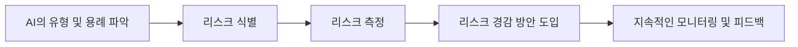

## AI PRM 개념

- AI 모델/시스템을 개발/제공할 때 프라이버시 리스크를 체계적으로 관리하기 위한 정부 차원의 모델
- 대규모 데이터 처리와 개인 정보 사용으로 인한 프라이버시 리스크, 적법한 데이터 활용, 권리 침해 방지, 투명성/안전성 확보

## AI PRM 리스크 관리절차, 유형, 경감방안

### AI PRM 리스크 관리절차

- AI 유형/용례 파악: AI 모델/시스템의 목적, 데이터 맥락 파악
- 리스크 식별: AI 모델/시스템의 유형/용례에 따라 발생 리스크 식별
- 리스크 측정: 발생확률, 중대성, 수용가능성, 우선순위 파악
- 리스크 경감 방안 검토/도입: 관리적/기술적 방안 검토 및 실행

### AI PRM 리스크 유형

| 구분 | 일반 리스크 | 프라이버시 리스크 |
| --- | --- | --- |
| 기획/개발 단계 | 저작권, 개인정보, DB권 등 권리침해 | 적법하지 않은 학습데이터 수집 이용 |
| |  | AI 학습데이터의 부적절한 보관/관리 |
| 서비스 제공 단계 | AI 합성콘텐츠 오용, 권치 침해 | 학습 데이터 암기 및 개인정보 노출 |
| | 편향, 차별, 양극화 | 자동화된 결정으로 인한 정보주체 권리 약화, 민감정보 추론 |
| 운영/유지보수 단계 | 업데이트 및 추가 학습으로 인한 리스크 누적 | 개인정보 보안 취약점, 데이터 이동 시 불법적 이용 |

### AI PRM 리스크 경감방안

| 구분 | 방안 | 예시 |
| --- | --- | --- |
| 관리적 | AI 시스템 기획 단계에서 개인정보의 목적·범위·처리 기준 명확화 | 개인정보 처리 방침 공개 |
| | 데이터 수집 출처·이력 관리 | 데이터 수집·이용 기준 수립 |
| | 조직 내 프라이버시 리스크 관리 정책·절차 수립 | 리스크 관리 절차 문서화 |
| | 지속적 평가·개선 | 정기적 내부 감사 |
| 기술적 | 데이터 최소화 및 비식별화 처리 | 차분 프라이버시 |
| | 프라이버시 향상 기술(PET) 적용 | 가명처리, 익명화 |
| | 암기 방지 필터링 기술 적용 | Presidio, KoELECTRA 필터링 |
| | 생성형 AI의 악의적 콘텐츠 방지 | 합성미디어 도용 방지 기술 |
| 조직적 | CPO 역할 강화 및 책임 명확화 | CPO 책임 범위 확대 |
| | AI 가치망 내 참여자 간 협력 체계 구축 | 계약 기반 협력 체계 수립 |
| | 외부 피드백 및 리스크 모니터링 시스템 도입 | 프라이버시 영향 평가 수행 |

## AI PRM 추가적인 고려사항

- PbD를 적용하여 AI의 설계 단계부터 프라이버시와 보안 고려
- GDPR, CCPA 등 개인정보 보호 규정을 철저히 준수

## 참조

- [개인정보보호위원회: AI 프라이버시 리스크 관리 모델](https://www.pipc.go.kr/np/cop/bbs/selectBoardArticle.do?bbsId=BS074&mCode=C020010000&nttId=10870)
