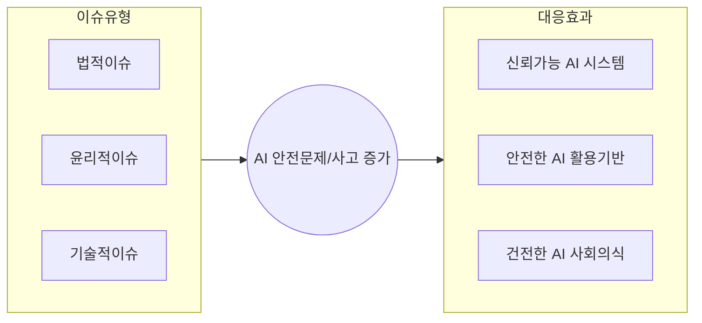

## AI 시스템 문제 개념

## AI 시스템 법적이슈 및 해결방안

### AI 시스템 법적이슈

| 구분 | 법적 이슈 | 설명 |
|---|---|---|
| 개인정보 보호 | 학습 데이터의 개인정보 | 인공지능 모델 학습을 위한 데이터의 규정 준수 필요 |
| | 데이터 사용 동의 및 권한 | 데이터를 수집, 사용하기 위한 법적 요구사항 필요 |
| | 개인정보 포함 결과물 | 공개된 정보에 포함된 개인정보 활용의 법적 문제 가능 |
| 지식 재산권 | AI 학습 데이터의 활용 | 학습 데이터의 저작권 침해 가능성 |
| | AI 생성물 저작권 | AI 생성 결과의 소유권 및 저작권 귀속 이슈 |
| | 저작권 침해의 책임 소재 | AI 생성 결과물의 저작권 관련 분쟁 이슈 |
| 이미지 및 음원의 사이버 정의 | 식별 가능한 신체특징 이미지 | 개인의 초상에 대한 비허가 촬영 문제 |
| | 딥페이크 | 생성된 AI 콘텐츠의 진위 여부 판별 문제 |
| | 음성 및 음악 저작권 침해 | 음성 생성물을 통한 저작권 관련 침해 문제 |

### AI 시스템 법적이슈 해결방안

| 구분 | 해결방안 | 설명 |
|---|---|---|
| 개인정보 보호 가이드라인 | 데이터 제어설정 | 데이터 제어 설정을 통한 채팅 기록 및 모델 학습 비활성화 |
| | 개인정보 입력 금지 | 민감정보(건강, 종교, 정치 성향 등) 입력 금지 |
| | 보안 인증 회피 | 올바른 절차 준수, 고객지원 센터를 통한 확인 |
| 생성형 AI 활용 가이드 및 제도 | 생성형 AI 콘텐츠 명시 | 생성형 AI 콘텐츠 출처 표기 가이드 마련 |
| | AI 활용 창작물 법적 근거 | AI 창작 콘텐츠에 대한 가이드라인 정의 |
| | AI 활용 가이드 및 위험관리 | AI 활용 시 재산 및 정서적 손해 최소화와 책임 보호 |
| AI 기술 표준화 | AI 관리 표준화 | 신뢰성, 거버넌스, 생애주기에 대한 표준 수립 |
| | AI 시스템 표준화 | AI 데이터, 컴퓨팅 등 표준화 및 지침 |
| | AI 응용서비스 표준화 | 클라우드, 보안 서비스 등 다양한 서비스의 표준화 |

## AI 시스템 윤리적이슈 및 해결방안

### AI 시스템 윤리적이슈

| 구분 | 윤리적 문제 | 설명 |
| --- | --- | --- |
| 진실성 및 정확성 이슈 | 허위 조작정보 및 가짜 뉴스 피해 | 퍼져있는 정보를 학습한 결과물 제시, 언론보도 및 소셜미디어로 인한 피해 |
| | 편향 정보 | 성차별, 인종차별 등 사회편견 내포 결과 제시 |
| | AI 포비아 | 인공지능 기술에 대한 비합리적 두려움이나 강한 거부감 |
| 창의성 및 효율성 이슈 | AI 의존 증가 | 검증 없는 생성형 AI 결과 활용, 일상생활, 의사결정, 업무 수행 등에 과도하게 의존 |
| | 인지 능력 퇴행 | 사고력, 문제 해결 능력 감소 및 약화 |
| | 문화, 예술성 저하 | 작품, 그림 및 악기 등의 예술 역량 저하 |
| 고도화된 AI 기술 기반 범죄 | 딥페이크 범죄 | 사진, 영상, 음성으로 제작된 가짜 콘텐츠로 명예훼손 또는 금전적 이익을 취하는 범죄 |
| | 보이스피싱 | 전화로 기관 또는 권위자를 사칭, 개인정보나 금전을 부정하게 취득하는 사기 수법 |
| | 디지털공간 확산 | 합성물에 의한 여론조작, 명예훼손의 위험 |

### AI 시스템 윤리적이슈 해결방안

| 구분 | 해결방안 | 설명 |
| --- | --- | --- |
| 이용자의 노력 | AI 부작용 진단 | 서비스 제공 기업의 생성형 AI 부작용 진단 및 대응 |
| | 윤리적 설계 | 윤리 및 책임감 기반의 기술 설계 |
| | 이용자보호 제도 | 국민이 안전하게 AI 활용할 수 있도록 제도 보완 |
| 교육 및 가이드라인 | AI 위험 교육 | 학교 및 기업 구성원을 대상으로 AI 위험에 대한 교육 수행 |
| | AI 가이드라인 | AI 기본 활용방향과 사용 시 지켜야 할 윤리 매뉴얼 |
| | 윤리사용 공감대 | AI 올바른 활용에 대한 공감대 형성 |
| | 윤리적 마인드 | 이용자 스스로의 판단/검토를 통한 안전한 활용 |
| 책임감 있는 사용 | 책임의 중요성 | 윤리적 책임의 중요성에 대한 사전 인식 |
| | 올바른 사용 | 올바른 사용의 필요성과 공감대 및 역기능 예방 |

## AI 시스템 기술적이슈 및 해결방안

### AI 시스템 기술적이슈

| 구분 | 기술적 문제 | 설명 |
| --- | --- | --- |
| 데이터의 한계 | 학습 데이터 제약 | 학습 데이터의 양, 질, 종류 제한으로 데이터 편향 및 부족 문제 발생 |
| | 패턴 의존성 | AI 모델이 학습 데이터의 특정 패턴에 지나치게 의존하는 문제 |
| | 학습 데이터 품질 | 데이터의 불완전성으로 인한 신뢰성 및 편향성 문제 |
| AI 모델의 한계 | 설명 불가 | AI 모델의 결정 과정을 명확히 설명하기 어려운 문제 (블랙박스 문제) |
| | 할루시네이션 | AI가 사실이 아닌 그럴싸한 답변을 생성하여 혼란을 초래하는 문제 |
| | 수동 조정 필요 | AI 학습 과정에서 사람의 개입이 필요한 과도한 조정 요구 |
| | 불명확한 범위 | AI 활용의 효과와 업무 영역 식별 부족으로 발생하는 문제 |
| AI 위험대응 문제 | 성능 기준 및 목표 부족 | 기대되는 결과물의 성능 기준이 명확하지 않음 |
| | AI 거버넌스 부족 | 책임 기반의 의사결정 체계 부재 및 인공지능 활용에 대한 명확한 가이드라인 부족 |

### AI 시스템 기술적이슈 해결방안

| 구분 | 해결방안 | 설명 |
| --- | --- | --- |
| AI 품질 관리 | XAI (설명 가능한 인공지능) | 인공지능 모델의 결정을 사람이 이해할 수 있도록 설명하는 기술 |
| | RAG (검색 증강 생성) | 답변 생성에 외부 리소스를 추가하는 기술 |
| | 데이터 품질 관리 | 데이터 품질에 따른 편견, 오류 확인 및 품질 보완 기술 적용 |
| AI 기술 고도화 | AutoML | 머신러닝 모델 개발 과정을 자동화하는 기술 |
| | 프롬프트 엔지니어링 | 원하는 결과를 얻기 위해 최적의 질문과 명령을 설계하는 기술 |
| | 병렬처리 및 분산 컴퓨팅 | 대량 데이터 연산에 효율적인 하드웨어 사용 (TPU, NPU 등) |
| 벤치마크 데이터 | 이미지넷 | 컴퓨터 비전 분야에서 널리 사용되는 대규모 이미지 데이터셋 |
| | GLUE | 자연어 처리 모델 성능 평가를 위한 벤치마크 데이터셋 |
| | KLUE | 한국어 이해 평가를 위한 벤치마크 데이터셋 |
| | KorQuAD | 한국어 기계 독해 데이터셋 |
| AI 거버넌스 체계 | AI 거버넌스 의사결정 체계 | 명확한 역할과 책임을 부여한 의사결정 체계 확립 |
| | 자동화 대상 정의 | 과정별 자동화를 통해 업무 프로세스 최적화 |
| | 단계적 로드맵 | 성과 도출 가능한 영역부터 시범 적용 후 점진적 확산 |
