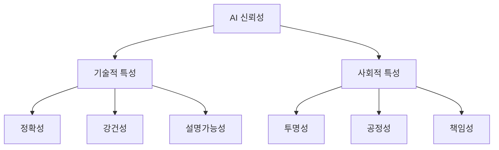

## AI 신뢰성 개념

- AI 기술에 내재한 위험과 한계를 극복하고, AI 시스템이 의사결정 및 활동에 영향을 받는 모든 이해관계자의 기대를 충족시키는 능력
- 안전성 보장, 사회적 신뢰 구축, 법적 규제 준수, 기업 경쟁력 강화

## AI 신뢰성 개념도, 상세설명, 정책동향

### AI 신뢰성 개념도

### AI 신뢰성 상세설명

|속성|설명|적용 사례|
|---|---|---|
|정확성|AI 시스템의 의사결정이 정확하고 신뢰할 수 있는지 보장|의료 진단, 자율주행 AI|
|강건성|환경 변화나 오류에 대한 저항성을 보장|자율주행 시스템의 장애물 감지|
|설명가능성|AI 의사결정의 근거와 과정을 명확히 설명 가능|AI 기반 금융 대출 시스템에서 설명된 점수 기준|
|투명성|AI의 개발 및 사용 과정을 명확히 공개|AI 채용 시스템의 평가 기준 공개|
|공정성|특정 집단에 대한 차별이나 편향이 없음을 보장|금융 대출 AI의 편향 제거|
|책임성|AI 의사결정과 결과에 대한 책임을 명확히 함|AI 의사결정 추적 및 기록|

### AI 신뢰성 정책동향

|구분|정책/표준|주요 내용|
|---|---|---|
| 국내 |TTA AI 신뢰성 인증|AI 생명주기 전반에 걸친 투명성, 공정성, 안정성 등을 인증|
| |신뢰할 수 있는 AI 개발안내서|AI 개발 및 배포 과정에서 윤리적 가이드라인 제공|
| 국외 |EU AI법|고위험 AI를 분류하고 적합성 평가를 통해 규제 적용|
| |NIST AI 위험관리 프레임워크|AI의 안전성과 설명 가능성을 포함한 위험 관리 프레임워크 제공|
| |ISO/IEC 22989|AI 신뢰성을 정의하고, 주요 속성을 제시|

- AITrustOps, AI TRiSM, NIA 인공지능 학습용 데이터 품질 가이드라인 등을 참고하여 다양한 관점에서 AI 신뢰성 확보 필요
