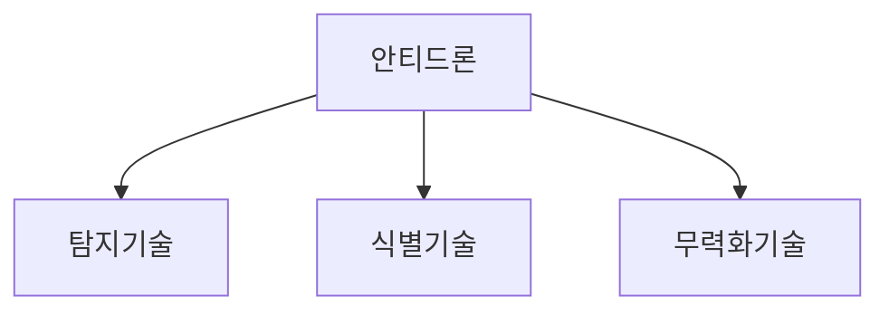

## 안티드론 개념

- 무인비행채 접근 탐지기술과 비행을 무력화 시키는 기술을 융합하여 드론 범죄나 테러 등을 예방하는 기술
- 사생활 침해 방지, 테러 방지, 보안시설 촬영 방지

## 안티드론 구성도, 핵심요소

### 안티드론 구성도

### 안티드론 핵심요소

| 분류 | 기술요소 | 설명 |
| --- | --- | --- |
| 탐지 | 레이더 | X-band / Ku-band 이용 탐지 |
| | RF 스캐너 | 통신 신호 분석 |
| | 광학카메라 | 강학신호 탐지 카메라 이용 |
| | IR 카메라 | IR 센서 탐지 카메라 이용 |
| 식별 | 육안식별 | 초고 고해상도 부착 식별 |
| | 전자식별 | 색채반응의 전자·원격식별 |
| Hard Kill | 고폭 / 네트 | 고폭 / 네트 이용 요격 |
| | 전자에너지 무기 | 레이저 / RF 광학전(GM) 공격 |
| Soft Kill | 통신 재밍 | 전파 방해로 비행통신 제어 |
| | 위성항법재밍 | 귀환 라디오 유리해 비행방향전환 |
| | 지오 펜싱 | 항법 SW GPS에 비행금지구역 정보 전송 |
