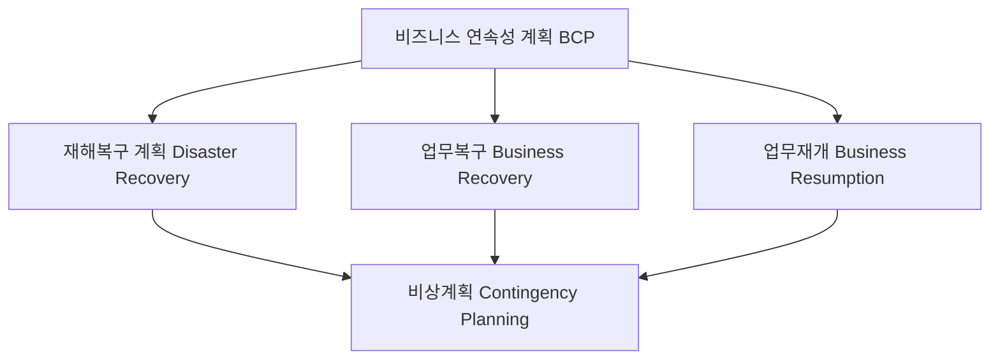

## BCP 개념

- ==재해나 위기 상황에서 조직의 핵심 비즈니스 기능이 지속될 수 있도록 마련된 계획==으로 IT 복구뿐만 아니라, ==전체 비즈니스 프로세스의 복원== 목표
- ==비지니스 연속성 보장==, 법적 규제 준수, ==고객 신뢰성 확보==, ==재무 손실 최소화==

## BCP 개념도, 구성요소, 절차

### BCP 개념도

### BCP 구성요소

| 종류    | 설명    | 비고    |
|---|---|---|
| ==재해복구== | IT 시스템과 데이터 복구 계획, 시스템 중단 시 신속한 복구 목표 | 데이터 백업 및 복구 절차 |
| ==업무복구== | 비즈니스 프로세스 복원 계획, 핵심 업무 프로세스가 중단 방지 | 핵심 업무 기능 복구 절차 및 우선순위 설정 |
| ==업무재개== | 중단된 업무의 재개를 위한 구체적인 절차, 계획 | 대체 프로세스, 임시 운영 절차 |
| ==비상계획== | 비상 상황에 대한 대비와 대응 계획, 예상치 못한 사건에 대한 대응 | 위기 관리 팀 구성, 대응 매뉴얼 마련 |

## BIA 절차

> Business Impact Analysis

| 구분    | 내용    | 비고    |
|---|---|---|
| ==주요 업무 식별== | 비즈니스 운영에 필수적인 핵심 업무 프로세스 식별 | 조직의 가치 사슬 분석 |
| ==재해 유형 분석== | 재해의 유형과 발생 가능성을 분석, 비즈니스 영향 평가 | FMEA |
| ==손실 평가== | 재해 발생 시 예상되는 재무적, 운영적 손실 평가 | 재무적, 운영적, 법적 손실 평가 기준 설정 |
| ==우선순위 설정== | 복구 대상의 우선순위를 설정하고, 복구 순서 결정 | 손실 비용 기반 |
| ==복구 목표 설정== | 서비스 목표 복구 시간, 데이터 손실 허용 시간 설정 | ==RTO==: 2h, ==RPO==: 0 |

## BCP 성공 포인트

- ==정기적인 훈련과 모의 테스트==를 통한 실전 대응 능력 향상
- ==Third Party Risk Management 전략 수립==
