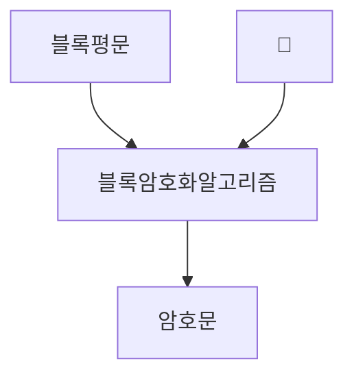
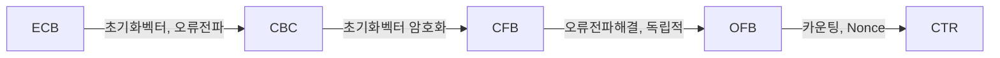

## 블록 암호화의 개념

- 평문을 고정길이의 블록 단위로 나누어 각 블록마다 암호화하여, 병렬 암호화 처리가 가능한 대칭키 암호화 방식
- 다양한 운영모드를 통한 암호화 요구사항 충족, 병렬 암호화 처리로 암복호화 성능 우수, 데이터 무결성, 기밀성 보장

## 블록암호화의 개념도, 주요 유형, 운영 모드

### 블록 암호화의 개념도

### 블록 암호화 주요 유형

| 구분 | 유형 | 내용 |
| --- | --- | --- |
| Feistal 방식 | DES | 56bit 키, 64bit 평문 블록 사용, 보안 취약성 존재 |
| - | LEA | 128bit 고속, 경량 환경 대응 |
| - | SEED | 128bit 평문, 국내 개발 |
| SPN 방식 | AES | 128bit 평문, 미국 표준 알고리즘 |
| - | ARIA | 초경량, HW지원용 알고리즘 |

### 블록 암호화 운영모드 비교

| 구분 | ECB | CBC | CTR |
| --- | --- | --- | --- |
| 초기화벡터 | 불필요 | 필요 | 필요 |
| 오류전파 | 미전파 | 이후블록 | 미전파 |
| 병렬처리 | 암복호화 | 복호화 | 암복호화 |
| 복잡도 | 낮음 | 중간 | 높음 |

- ECB 모드는 Brute-Force 공격에 취약하므로 다른 모드 사용 권장

## 블록 암호화시 고려사항

- 암호화 키를 주기적으로 변경하는 등의 키관리 조치 필요
