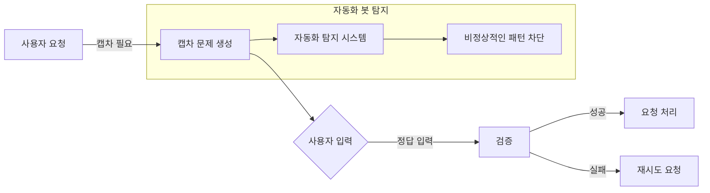

## 캡차 개념

- 인간을 구별할 수 있지만 컴퓨터는 구별하기 힘든 의도적인 이미지나 텍스트를 제시하여 봇이 접근하는 것을 방어하는 기술

## 캡차 개념도, 유형, 보안 강화 방안

### 캡차 개념도

### 캡차 유형

| 구분 | 세부 유형 | 설명 |
| --- | --- | --- |
| 텍스트 방식 | 텍스트를 이미지화 | 사용자가 왜곡된 문자/숫자를 해독하여 입력 |
| | 질문 응답 | 간단한 수학 문제나 논리 문제를 풀도록 유도 |
| 오디오방식 | 입력텍스트를 오디오로 출력 | 시각 장애인을 위한 대체 방법으로, 음성으로 캡차 제공 |
| 이미지방식 | 이미지 분류 | 특정 조건에 맞는 이미지를 선택하도록 요구 |
| | 이미지 퍼즐 | "나는 로봇이 아닙니다" 체크박스, 퍼즐 조각 맞추기 |

### 캡차 보안 강화 방안

| 구분 | 방안 | 내용 |
| --- | --- | --- |
| 난독화 강화 | 텍스트 왜곡 및 노이즈 추가 | OCR(광학 문자 인식) 기술을 우회하기 어렵게 함 |
| 멀티모달 적용 | 이미지 + 오디오 조합 | 시각/청각 장애인을 고려하면서 보안성 강화 |
| 사용자 행동 감지 | 마우스 움직임 및 키 입력 분석 | 인간 사용자의 행동 패턴을 학습하여 봇 탐지 |
| AI 대응 | 동적 캡차 생성 | 캡차 패턴을 인공지능이 학습하지 못하도록 랜덤화 |
| 인증 연계 | MFA(다중 인증) 활용 | 로그인 과정에서 추가적인 보안 요소로 활용 |
