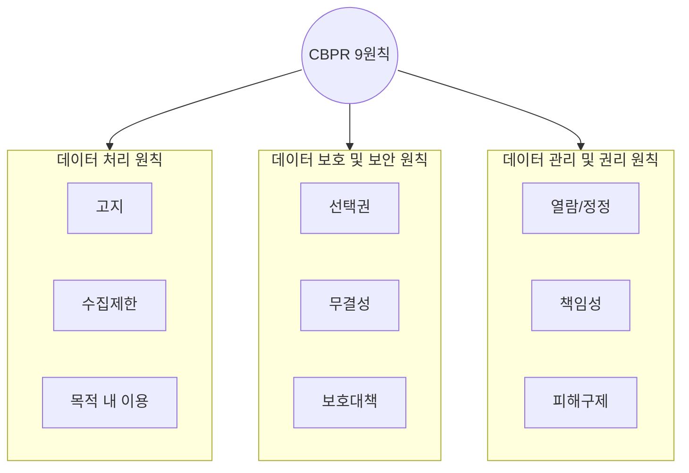

## CBPR 개념

- APEC 프라이버시 보호 원칙을 기반으로 기업의 개인정보 보호체계를 평가하여 인증하는 글로벌 인증제도
- 각국 법제도 비대채성, 자발성, 유연성, 개인정보 국경 간 이동 등 활용 중심

## CBPR 개념도, 핵심요소, 인증기준

### CBPR 개념도

- APEC 내 개인정보 처리 기업이라면 CBPR인증 후 개인정보 주체 동의 없이 갱니정보 국외 이전 가능

### CBPR 핵심요소

| 구분 | 핵심요소 | 설명 |
| --- | --- | --- |
| 목적 | 전자상거래 활성화 | APEC 내 국가 간 개인정보 흐름을 원활하게 하여 디지털 경제 촉진 |
| | 개인정보보호 | 개인정보의 적절한 보호를 보장하면서도 기업의 데이터 활용과 국제 데이터 전송을 지원 |
| 적용범위 | APEC 회원국 | APEC에 가입한 국가들을 대상으로 하며, 회원국 간의 상호인정 협약 기반으로 운영 |
| 대상 | 개인정보 | 개인을 식별할 수 있는 모든 정보에 적용 |
| | 개인정보처리자 | 개인정보를 수집, 저장, 이용 및 공유하는 기업 또는 조직이 적용 대상 |
| | 수탁처리자 제외 | 개인정보를 직접 처리하는 기업(Controller)에 초점을 맞춤 |
| | | 단순 데이터 처리만 수행하는 수탁업체(Processors)는 직접적인 적용 대상이 아님 |
| 갱신주기 | 1년 단위 갱신 | CBPR 인증을 받은 기업은 매년 개인정보 보호 준수 여부를 평가받아야 하며, 갱신을 통해 지속적인 적합성을 유지 |

### CBPR 인증기준

| 분야 | 세부분야 | 내용 |
| --- | --- | --- |
| 개인정보관리체계수립 | 정책 및 절차 수립 | 기업 및 조직이 개인정보 보호를 위한 정책과 절차를 문서화하고 준수하도록 요구 |
| | 책임성 확보 | 개인정보 보호책임자 지정, 기업의 개인정보 보호 조치 이행 및 지속적 개선 요구 |
| 개인정보 수집 | 최소 수집 원칙 | 개인정보는 목적에 필요한 최소한의 정보만 수집하도록 제한 |
| | 투명성 확보 | 개인정보 수집 시 정보주체에게 수집 목적, 이용 범위 등을 명확히 고지 |
| 개인정보 이동/위탁/제공 | 목적 내 이용 | 개인정보는 수집된 목적 내에서만 사용해야 하며, 목적 변경 시 추가 동의 필요 |
| | 제3자 제공 제한 | 개인정보를 제3자에게 제공할 경우 명확한 동의 절차 및 보호 조치를 마련해야 함 |
| 정보주체 권리 | 열람 및 정정 | 정보주체는 자신의 개인정보에 대한 열람 및 정정을 요구할 수 있어야 함 |
| | 선택권 및 동의 철회 | 정보주체는 자신의 개인정보 이용에 대한 선택권을 가지며, 언제든 동의를 철회할 수 있음 |
| 무결성 | 데이터 품질 유지 | 개인정보가 정확하고 최신 상태로 유지될 수 있도록 관리 |
| | 보관 및 삭제 정책 | 불필요한 개인정보는 보관하지 않고, 일정 기간 후 안전하게 삭제해야 함 |
| 보호대책 | 기술적 보호조치 | 암호화, 접근제어, 침입탐지 등 개인정보 보호를 위한 기술적 조치 요구 |
| | 물리적 보호조치 | 개인정보를 저장하는 서버, 네트워크, 문서 등의 안전한 보호 필요 |
