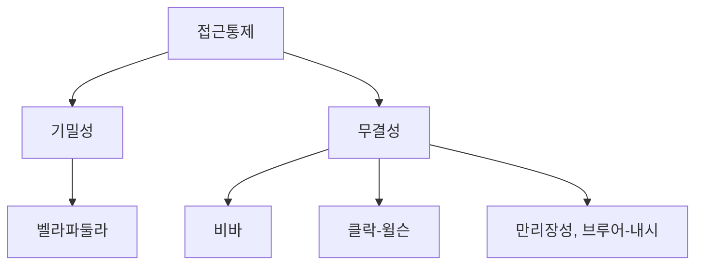
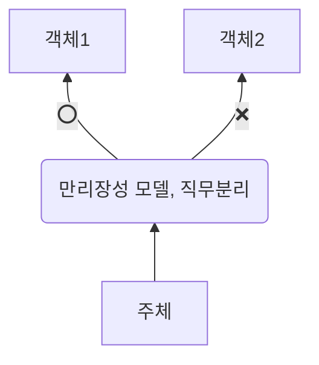

## 만리장성 모델의 개념

- 정보의 이해 상충 문제를 해결하기 위해 고안된 접근 통제 모델로 동일 조직 내에서 서로 다른 이해관계자가 특정 정보에 접근하는 것을 제한하여 정보 유출 및 오용 방지.
- 직무 분리, 이익 충돌 방지

## 만리장성 모델의 구성도, 구성요소

### 만리장성 모델 구성도

### 만리장성 모델 구성요소

| 구분 | 내용 | 비고 |
| --- | --- | --- |
| 주체 | 정보에 접근하는 개인 또는 그룹 | 컨설턴트, 변호사 등 |
| 객체 | 접근이 제한되는 정보 자원 고객 정보 | 기업 비밀, 사건 자료 |
| 충돌 집합 | 서로 이해 상충 관계에 있는 객체들의 집합 | 동일 업종, 경쟁 기업 정보 등 |
| 접근 기록 | 주체의 과거 정보 접근 이력 | 이해 상충 여부 판단 |

## 만리장성 모델 적용시 고려사항

| 구분 | 내용 | 비고 |
| --- | --- | --- |
| 정보 분류 | 이해 상충 관계의 명확한 정의 | 모호할 경우 오류 발생 가능 |
| 유연성 | 새로운 정보 유형 발생, 권한 변경 시 모델 수정 | 지속적인 업데이트 |
