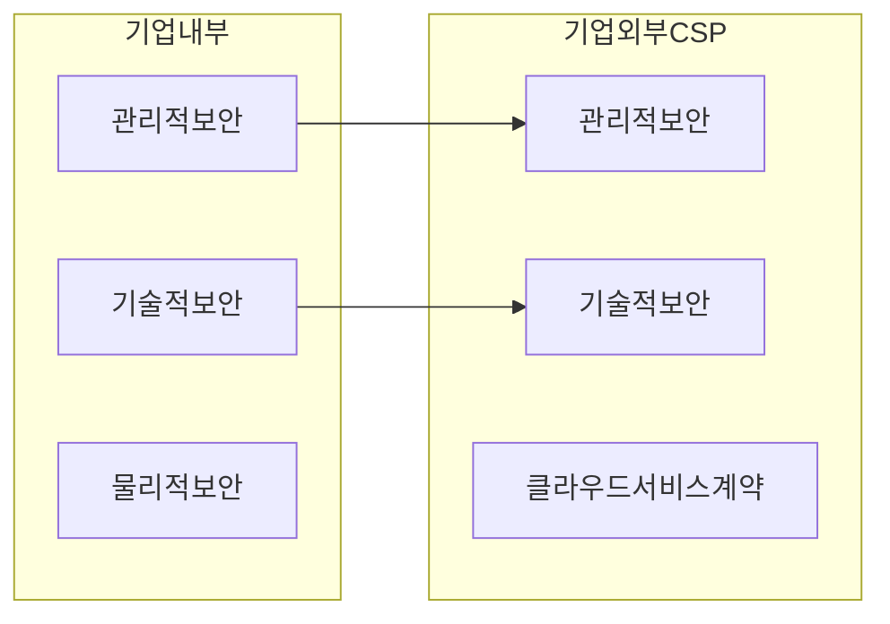

## 클라우드 보안 개념

- 클라우드 컴퓨팅 환경에서 데이터를 보호하고, 어플리케이션 및 인프라의 보안을 유지하기 위한 관리적, 물리적, 기술적 보안
- 2025년까지 모든 행정 공공, 정보시스템 클라우드 전환 시 데이터 보호와 서비스 신뢰성 확보를 위해 필요

## 클라우드 보안 개념도, 주요 위협, 대응 방안

### 클라우드 보안 개념도

- 기존 기업의 보안 프레임워크가 클라우드로 확장, 클라우드 서비스 제공 데이터센터의 물리적 보안은 CSP책임

### 클라우드 보안 주요 위협

| 구분 | 위협 | 내용 |
| --- | --- | --- |
| SaaS | 정보 훼손 및 유출 | 고객 정보 훼손 및 유출 위협 |
| | 웹 취약점 공격 | 악성코드, 인젝션, XSS 등 |
| | 버전 통제 문제 | 다른 버전 서비스 호환 가능성 |
| PaaS | Buffer Overflow | 제공된 자원 권한 이상 접근 |
| | 표준화 부재 | 설계, 코딩 표준 부재 |
| | 인증 문제 | 취약한 인증, 계정 탈취, 플랫폼 종속 |
| IaaS | 가상화 취약점 | 하이퍼바이저, 도커 취약점 |
| | 서버 관리 문제 | DDoS, 시스템 장애 |
| | 데이터 손실 문제 | 고객 데이터 유실 |

### 클라우드 보안 대응방안

| 구분 | 내용 | 비고 |
| --- | --- | --- |
| 관리적 | 보안 정책 수립, 시행 | 보안 거버넌스 확립, SLA 협약 |
| | 교육 및 훈련 | 클라우드 보안 교육, 대응방안 교육 |
| 물리적 | 데이터센터 보안 | 물리적 보안 강화, 접근 통제 |
| | 백업 및 재해복구 | 데이터 손실, 서비스 중단 대응 |
| 기술적 | 암호화 | 데이터 자체와 N/W 구간 암호화 |
| | 방화벽, IDS, IPS | 트래픽 감시, 사전 차단 |

- SDN, IAM 등을 활용하여 최소 권한 부여

## 클라우드 보안 고려사항

- 각 국의 산업 표준 및 법적 요구사항 준수 필요
