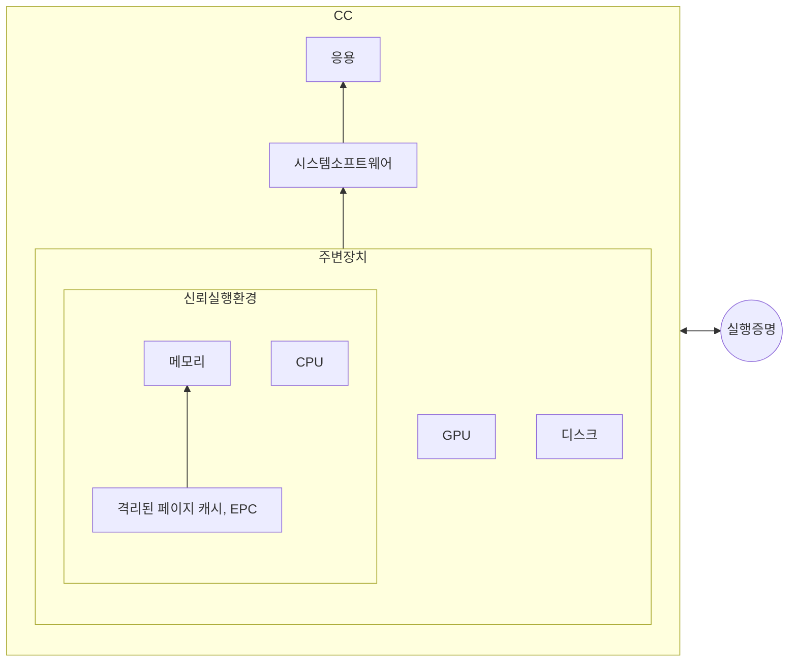

## 컨피덴셜 컴퓨팅 개념

- 데이터 보호와 개인 정보 보안에 중점을 둔 컴퓨팅 환경을 제공하는 기술로 격리, 접근통제, 암호화, 키 관리 기술을 ==하드웨어로 구현==하여 소프트웨어보다 더 강력한 통제 보장
- 클라우드 환경에서 데이터 유출 및 무단 접근 방지, 클라우드 운영자나 제3자에 대한 완전 신뢰 없이 데이터 보호 가능, 기밀성 유지

## 컨피덴셜 컴퓨팅 구성도, 구성요소, 적용방안

### 컨피덴셜 컴퓨팅 구성도

### 컨피덴셜 컴퓨팅 구성요소

| 구분 | 내용 | 비고 |
| --- | --- | --- |
| 신뢰 실행 환경 | 하드웨어 기반 격리로 민감 데이터 보호 및 외부 접근 차단 | Intel SGX, AMD SEV 등 |
| 실행 증명 | 실행 중인 코드 무결성을 검증하여 신뢰성을 보장 | 원격 검증, 내장형 시스템 |
| 주변 장치 | GPU, FPGA 등 신뢰 가능한 컴퓨팅 환경 확장 | 보안 기능 통합, 주변 장치 비신뢰 |
| 운영 체제 | TEE 기반 보안 운영체제를 통해 응용 프로그램 실행 | 사용자 친화적 API 지원 |
| 응용 프로그램 | 기밀성을 보장하며 연산 수행 | TPM 활용 |

### 컨피덴셜 컴퓨팅 적용방안

| 구분 | 이슈 | 적용방안 |
| --- | --- | --- |
| 신뢰 실행 환경 | 부채널 분석공격, 성능 저하, 수학적 모델 부재 |관련 방어기법 연구, 증명가능한 TEE 개발 |
| 실행 증명 | 공개된 표준 프로토콜 부재 | 업계 표준 수립 |
| 주변 장치 | 디스크 저장 데이터에 대한 비신뢰 OS의 접근 | 가상머신 단위 격리 |
| 운영 체제 | 암복호화로 인한 성능 하락 | TPM 가상화 |

## 컨피덴셜 컴퓨팅 주요 고려사항

- RISC-V와 같은 오픈소스 CPU 설계 생태계의 확장으로 인해 컨피덴셜 컴퓨팅에 대한 국내 연구와 생태계 구축

## 참조

- [IITP: 주간기술동향 2125호](https://iitp.kr/kr/1/knowledge/periodicalViewA.it?searClassCode=B_ITA_01&masterCode=publication&identifier=1310)
