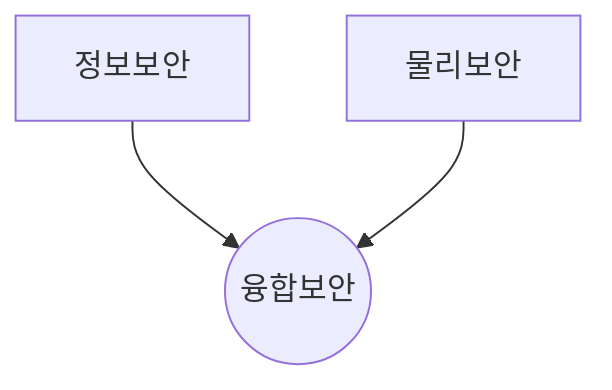
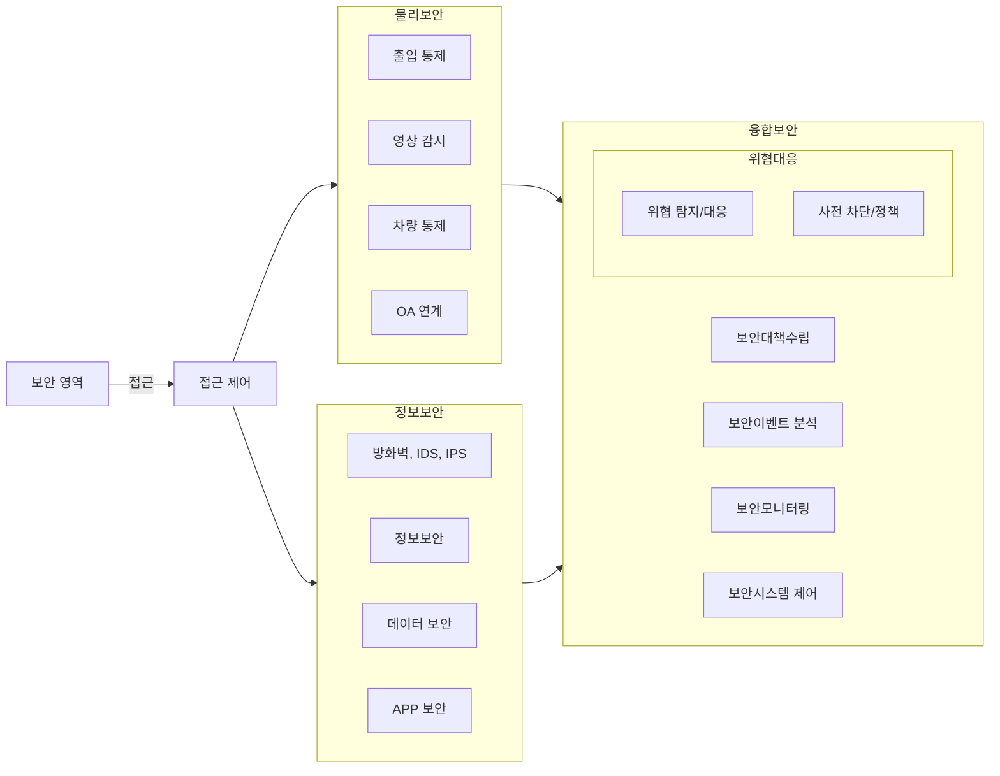

## 융합보안관제 개념

- 컴퓨터/네트워크 상 정보의 위변조, 유출을 막기위한 정보보안과 개인의 신변 안전 및 주요시설 안전 관리를 위한 물리보안을 IT 신기술과 융합하여 미리 위협을 탐지하고 해결하기 위한 보안 관제
- 사이버 위협 증가 / 운영효율성, 원가절감 / 통합보안 요구, 빅데이터 활용 / 보안 관리 복잡성 증가, 사용자 편리성 제고

## 융합보안관제 구성도, 구성요소

### 융합보안관제 구성도

- SIEM을 활용한 통합 보안 이벤트 관제 필요

### 융합보안 관제 구성요소

| 구분 | 세부요소 | 설명 |
| --- | --- | --- |
| 정보수집 | IoT 센서 | 환경 모니터링, 물체 움직임 감지 센서 |
| 물리보안 | 출입 통제기 | 인가자 이외의 출입 가능 통제 |
| | 영상 감시 시스템 | 영상 분석을 통한 인가/비인가자 판별 |
| 정보보안 | 접속관리 | 인증 및 패킷 분석, 침입차단 |
| | NW 침입탐지 시스템 | IDS, IPS 등을 통한 네트워크 보안 |
| 융합보안 | 통합 보안 이벤트 분석 | 물리/정보보안 이벤트를 통합 분석, 패턴 감지 |
| | 빅데이터 저장소 | 정보 및 보안 데이터 수집, 저장 및 가공 |
| 보안대응 | 침해 대응 장비 | DDoS 대응 장비, 안티바이러스 등 |
| | 침해 관제 분석 | 침해 분석 및 탐지 분석 기능 |
