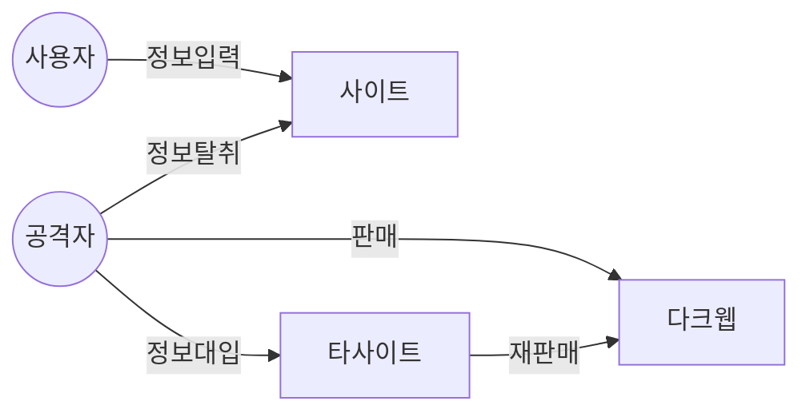

## 크리덴셜 스터핑의 개념

- 공격자가 미리 확보한 사용자의 계정, 인증정보를 이용하여 다른 사이트에 무작위로 대입하여 정보를 탈취하는 사이버 공격
- 인터넷 사용자가 동일 로그인 정보를 여러 사이트에서 사용한다는 점을 노린 자동화 공격

## 크리덴셜 스터핑 개념도, 공격절차, 대응방안

### 크리덴셜 스터핑 개념도

- 무차별 대입 공격으로 탈취한 정보를 판매하여 2차 피해 발생

### 크리덴셜 스터핑 공격절차

| 구분 | 절차 | 설명 |
| --- | --- | --- |
| 수집 | 백도어 삽입 | 취약점 이용 백도어 삽입 |
| | 개인정보 탈취 | 내부시스템의 계정, 인증 정보 탈취 |
| 공격 | 무차별 대입 공격 | 계정정보로 무차별 로그인, 권한 획득 |
| | 중요정보 탈취 | 중요정보 탈취 후 협박, 유포, 금전 요구 |
| 반복 | 중요정보 판매 | 정보를 다크웹에 판매, 공개 |
| | 추가피해 발생 | 공개된 정보로 추가 공격 수행 |

### 크리덴셜 스터핑의 대응방안

| 구분 | 방안 | 설명 |
| --- | --- | --- |
| 개인 | 사이트별 고유 계정 사용 | 동일 정보 사용 지양 |
| | 다단계 인증 활성화 | MFA 등 2단계 인증 활성화 |
| | 회사 이메일 사용 지양 | 가입시 개인 이메일 사용 |
| 기업 | 보안 모니터링 | 트래픽 탐지로 동일 IP 차단 |
| | 로그인 시도 제한 | 자동화 공격 방지 |
| | 대응 계획 수립 | 개인 보안 조치, 주기적 교육 |

- 크리덴셜 스터핑 공격은 자동화되어있으므로, 트래픽 변화, 로그인 실패 빈도 증가 등 선행 징조 확인 필요

## 크리덴셜 스터핑 대응시 고려사항

- 공격을 사전에 예방하기 위해 IP보안, 2단계 인증 등 사용성을 고려한 보안 정책 도입 필요
