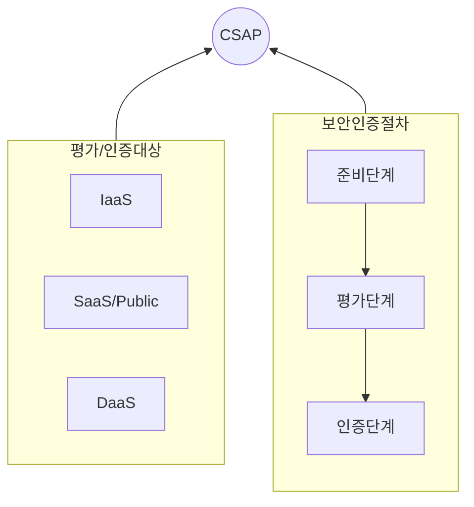

## CSAP 개념

- 사용자가 안심하고 클라우드 서비스를 이용할 수 있도록 클라우드 서비스 제공자의 서비스를 인증기관이 평기/인증하여 지원하는 제도

## CSAP 평가인증 구성도 유형, 주요항목

### CSAP 평가인증 구성도

### CSAP 평가인증 유형

| 구분 | 유형 | 내용 |
| --- | --- | --- |
| 평가대상 | 클라우드기반 서비스 | IaaS, SaaS, PaaS, Daas |
| 평가인증 종류 | 평가 시점 및 인증 등급 | 평가 최초, 사후, 갱신 |
| | | 표준(IaaS/SaaS/DaaS), 간편(SaaS) |
| 평가인증 조직 | 정책, 평가, 인증, 자문 | 정책(과기부), 평가/인증(KISA), 자문(국가보안연구소) |

### CSAP 주요항목

| 구분 | 항목 | 내용 |
| --- | --- | --- |
| 관리적 | 정책/조직 | 클라우드 서비스 제공자의 보안 정책 수립 및 조직 운영 |
| | 인적보안/교육 | 임직원 및 관계자의 보안 교육, 권한 관리, 접근 통제 강화 |
| | 자산 식별 관리 | 클라우드 내 IT 자산(서버, 스토리지, 네트워크) 식별 및 보호 |
| | 침해사고 관리 | 보안 사고 대응 프로세스 수립, 침해사고 탐지 및 보고 체계 운영 |
| 물리적 | 출입통제 | 데이터센터 출입 권한 관리 및 접근 통제 절차 마련 |
| | 식별/인증 | 데이터센터 및 주요 시스템 접근자에 대한 인증 절차 강화 |
| | 물리적 보호 구역 | 보안 구역 설정, 감시 카메라, 출입 기록 관리 |
| | 장비보호 | 서버 및 네트워크 장비의 보호 및 물리적 환경(온도, 습도) 관리 |
| 기술적 | 가상화 환경 인프라 | 가상 머신(VM), 컨테이너 보안 및 하이퍼바이저 보호 |
| | 접근권한 인증 | 사용자 및 관리자 접근 권한 제어, MFA(다중 인증) 적용 |
| | 네트워크 보안/암호화 | 데이터 암호화, IDS/IPS 적용, 방화벽 운영 및 보안 프로토콜 활용 |

## CSAP 개편안

| 등급 | 대상시스템 | 비고 |
| --- | --- | --- |
| 상 | 민감정보, 행정 내부 업무 운영 시스템 | 높은 보안 요구사항 적용 (망분리 필수) |
| 중 | 비공개업무자료 포함 또는 운영시스템 | 제한적인 인터넷 접근 허용, 강화된 보안통제 적용  |
| 하 | 개인정보 미포함, 공개된 공공데이터 운영 시스템 | 논리적 망분리 허용 |
