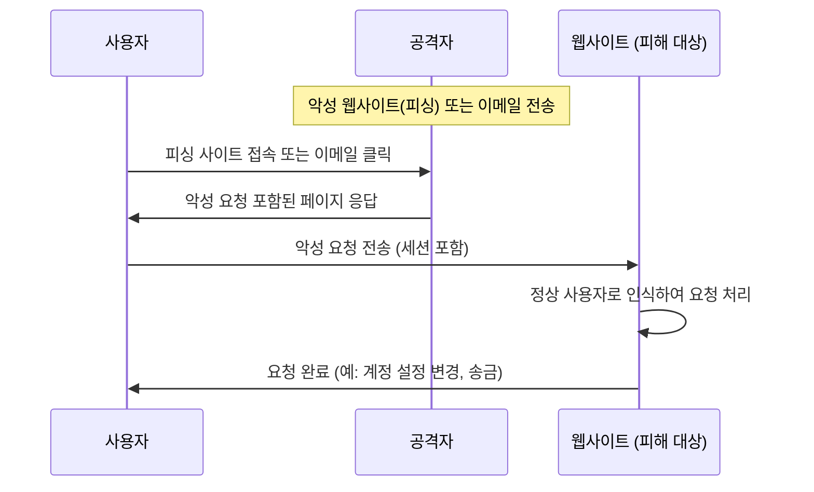

## CSRF 개념

- 사이트 간 요청을 위조하여 사용자가 자신의 의지와 무관하게 공격자의 행위를 수행하도록 하는 보안 공격 기법
- 사용자의 세션을 악용하여 비밀번호 변경, 결제 요청, 데이터 조작 등의 불법적인 요청 실행

## CSRF 공격 매커니즘, 공격 절차, 대응방안

### CSRF 공격 매커니즘

### CSRF 공격 절차

| 단계 | 설명 | 예시 |
| --- | --- | --- |
| 1. 공격 준비 | 공격자가 악성 웹사이트, 이메일 등을 통해 CSRF 공격을 수행할 환경을 구축 | 피싱 사이트 생성, 악성 링크 포함된 이메일 발송 |
| 2. 공격 수행 | 사용자가 악성 사이트에 접속하면 자동으로 요청이 실행됨 | 자동 POST 요청, 이미지 태그를 통한 GET 요청 포함 |
| 3. 피해 발생 | 사용자의 세션을 활용하여 원치 않는 요청이 실행됨 | 비밀번호 변경, 송금 요청, 계정 삭제 |

### CSRF 공격 대응방안

| 구분 | 대응방안 | 내용 |
| --- | --- | --- |
| 토큰 기반 방어 | CSRF 토큰 (CSRF Token) | 요청 시마다 난수 기반 토큰을 포함하여 서버에서 검증 |
| 인증 기반 방어 | SameSite 속성 사용 | 쿠키의 SameSite 속성을 Strict 또는 Lax로 설정하여 CSRF 방어 |
| HTTP 헤더 검증 | Referer 및 Origin 검증 | 요청의 Referer 또는 Origin 값을 확인하여 출처가 올바른지 검증 |

## CSRF, XSS 비교

| 구분 | XSS | CSRF |
| --- | --- | --- |
| 개념 | 공격자가 악성 스크립트를 삽입하여 실행하는 공격 | 사용자의 인증된 세션을 악용하여 원치 않는 요청을 보내는 공격 |
| 공격 방식 | 클라이언트 측에서 실행되는 JavaScript 코드 | 서버 측에서 사용자의 세션을 도용하여 요청 수행 |
| 주요 피해 | 사용자 정보 탈취, 세션 하이재킹, 웹사이트 변조 | 비밀번호 변경, 송금, 계정 삭제 등 원치 않는 행동 수행 |
| 방어 기법 | CSP(Content Security Policy), 입력 검증, HTTPOnly 쿠키 사용 | CSRF 토큰, SameSite 쿠키, Referer 검증 |
