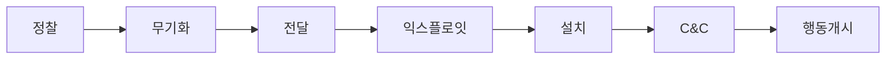

## 사이버 킬체인 개념

- 사이버 공격의 단계별 절차를 체계적으로 분석하여 방어할 수 있도록 하는 모델
- 사이버 공격 단계별 대응 방안 수립 가능, 사전 위협 탐지, 차단, 침해 대응

## 사이버 킬체인 절차도, 세부절차, 대응방안

### 사이버 킬체인 절차도

> 정무전 익설 씨행

### 사이버 킬체인 세부절차

| 구분 | 내용 | 비고 |
|---|---|---|
| 정찰  | 목표 시스템 및 네트워크 정보 수집 (예: IP 주소, 도메인, 취약점 등)  | Passive, Active 정찰 |
| 무기화| 악성코드 제작 및 공격 도구 개발   | 악성 문서, 익스플로잇 키트 등 |
| 전달  | 악성코드 전송 (예: 이메일 피싱, 웹사이트 악성 링크 등) | 사회공학 기법 포함  |
| 익스플로잇| 시스템 익스플로잇 이용하여 악성코드 실행  | 취약점 패치 필수  |
| 설치  | 악성코드 설치 및 지속적 접근 확보 | 루트킷, 백도어 등 사용  |
| C&C   | 외부 서버와 통신하여 원격 제어 실시   | 암호화 통신 사용  |
| 행동 개시 | 데이터 탈취, 시스템 파괴, 랜섬웨어 실행 등 목표 달성 | 공격 목표에 따라 상이  |

### 사이버 킬체인 대응방안

| 구분 | 방안 | 비고|
|-------------------|---------------------------------------------------------------------------------|-------------|
| 정찰  | 침해 탐지 시스템(IDS) 및 침입 방지 시스템(IPS) 설치, 로그 분석   | 사전 탐지 중요  |
| 무기화| 보안 교육 및 훈련, 사회공학 기법 인식 향상  | 사용자 교육 필요  |
| 전달  | 이메일 필터링, URL 필터링, 악성코드 탐지 솔루션 사용 | 콘텐츠 필터링  |
| 익스플로잇| 익스플로잇 관리 및 패치, 애플리케이션 보안 강화  | 정기적 패치  |
| 설치  | 실행 파일 모니터링, 비정상 행위 탐지 | 엔드포인트 보안  |
| C&C   | 네트워크 트래픽 모니터링, 비정상 트래픽 차단| 포렌식 분석  |
| 행동 개시 | 데이터 암호화, 백업 및 복구 계획 수립, 침해 사고 대응팀 운영   | 피해 최소화 전략  |

## 사이버 킬체인 고려사항

- 사이버 공격은 사회공학 기법을 이용하므로, 주기적인 사용자 교육과 모의 훈련 필요
