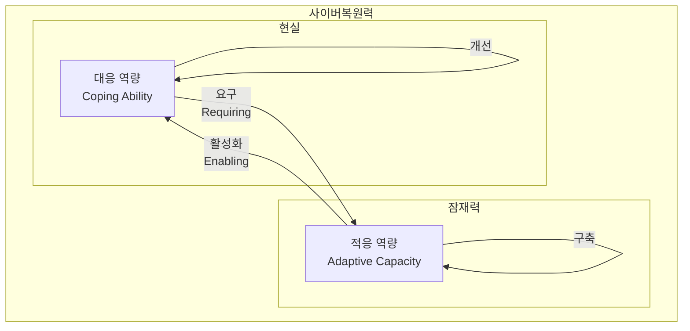

## 사이버 복원력 개념

- 사이버 공격이나 관련 문제에 대해 적극 대응하고, 공격으로 인해 발생된 피해로부터 신속하게 정상화 및 회복하는 활동
- MS CrowdStrike 보안 업데이트, xz backdoor 이슈 등 소프트웨어 공급망 장애로 인해 중요성 강조

## 사이버 복원력 구성도, 구성요소, 비교

### 사이버 복원력 구성도

- 두 역량의 상호작용을 통한 비지니스 연속성 제고

### 사이버 복원력 구성요소

| 구분 | 내용 | 비고 |
| --- | --- | --- |
| ==비지니스 연속성== | 정보시스템 보호를 넘어 비지니스 임무, 목표의 지속적 달성 | ==BCP== |
| ==전사적 활동== | IT자산과 보안부서 활동을 넘어서 전사적 기술, 사람의 노력 필요 | ITAM, ITSM |
| ==생태계 보호== | 상호 연결된 협력사, 외부 기관가 시스템을 보호하기 위한 상호 협력, 정보 공유 | ==TPRM== |

### 사이버 복원력, 사이버 보안 비교

| 구분 | 사이버 복원력 | 사이버 보안 |
| --- | --- | --- |
| 개념 | 사이버 자산을 운용하는 조직차원에서 역량 | 사이버 공격 등 위협으로부터 데이터 및 IT시스템 보호 |
| 객체 | 비지니스 결과물 전달 보장 | 데이터, 정보시스템, 네트워크 등 보호 |
| 적용 범위 | 전사적, 관련 조직, 생태계 | 보안 부서 |
| 목표 | 비지니스 요구사항, 연속서 유지 | 사이버 공격 위험 저하, IT자산 보호 |
| 특징 | 사고 예측, 탐지, 복구 역량 강화, 보안 모범 사례 정규화 등 | 위협 예방, IT 통제, 접근제어 |
| 관점 | 조직차원 내재 역량 | 사이버 자산 대상 기술 및 솔루션 도입 보호 |

## 사이버 복원력 동향

- 바이든행정부 국가안보전략 상 사이버복원력 확보를 위한 국가적 협력 강조 및 방안 제시
- 주요 기반 시설의 위험을 감소시키고 복원력을 강화하기 위한 ==BCP, DRP== 수립 필요
