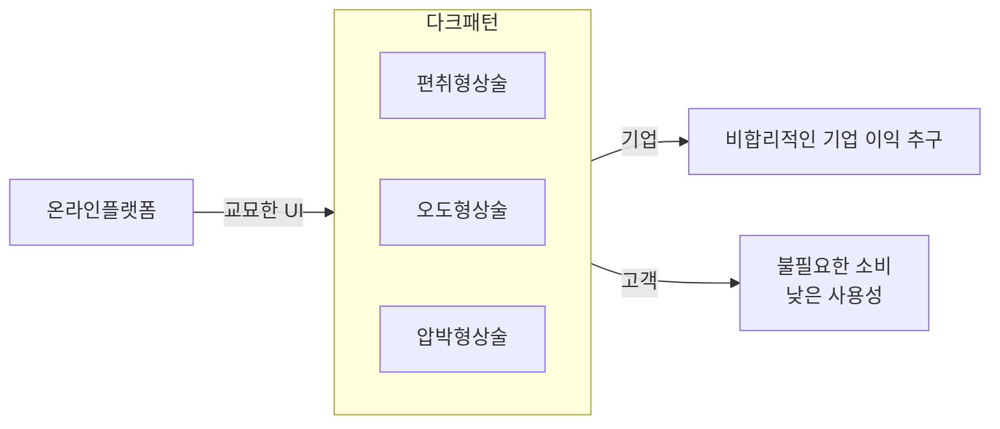

## 다크패턴 개념

- 기업의 이익을 목적으로 이용자를 속이기 위해 교묘하게 설계된 사용자 인터페이스 패턴
- 온라인 시장 점유율 상승, 비대면 거래 확산, 기업 이익도모, 공정거래위원회 다크패턴 유형 정의

## 다크패턴 개념도, 유형, 대응방안

### 다크패턴 개념도

### 다크패턴 유형

| 구분 | 유형 | 설명 |
|---|---|---|
| 편취형 | 숨은 결제 | 무료에서 유료로 전환 시 별도 고지 없이 결제를 유도하는 행위 |
| | 순차공개 가격책정 | 초기 낮은 가격 표시 후 결제 시 추가 금액을 부과하는 행위 |
| | 몰래 장바구니 추가 | 소비자가 선택하지 않은 상품을 자동으로 추가하는 행위 |
| | 거짓 할인 | 할인 정보 조작으로 소비자를 유도하는 행위 |
| | 거짓 추천 | 허위 리뷰 조작으로 상품 구매를 유도하는 행위 |
| | 유인 판매 | 판매 불가능 상품을 광고하여 다른 상품 구매를 유도하는 행위 |
| | 위장 광고 | 광고임을 숨기고 콘텐츠처럼 보이게 제작된 광고 제공 |
| 오도형 | 숙의식 질문 | 긴 설명이나 과도한 정보를 제시하여 혼란을 유도하는 행위 |
| | 잘못된 계층 구조 | 불리한 옵션을 소비자가 선택하도록 구성하는 행위 |
| | 특정 옵션의 사전 선택 | 유리한 옵션을 미리 선택된 상태로 제공하는 행위 |
| 방해형 | 취소·탈퇴 방해 | 취소·탈퇴 과정을 복잡하게 하거나 제한하는 행위 |
| | 숨겨진 정보 | 결정을 위한 중요 정보를 숨기는 행위 |
| | 가격 비교 방해 | 상품 간 가격 비교를 어렵게 만드는 행위 |
| 압박형 | 클릭 필요 옵션 유발| 불필요한 클릭을 유도하여 불리한 선택을 하게 만드는 행위 |
| | 반복 간섭 | 특정 행동을 반복적으로 강요하는 행위 |
| | 감정적 언어사용 | 감정을 자극하는 언어 표현을 통해 소비자 행동 압박 |
| | 시간제한 알림 | 특정시간/기간에만 할인된 가격으로 표시하여 소비자 의사결정 압박 |
| | 낮은 재고 알림 | 재고가 없거나 수요가 높다고 표시하여 소비자 으사결정 압박 |
| | 다른 소비자 활동 알림 | 최근 해당 제품을 보거나 구매한 소비자 수 표시하여 소비자 의사결정 압박 |

### 다크패턴 대응방안

| 구분 | 대응방안 | 설명 |
|---|---|---|
| 제도적 측면 | 법 집행 강화 | 표시광고법 및 전자상거래법 적용, Data Act, DSA, DMA 등의 규제 준수 |
| | 제도개선 | 가이드라인 제정 및 법 개정 추진 |
| | 적합성평가 | 지속 모니터링하여 디지털 공정성 적합성 평가 수행 |
| | 쿠키배너 동의관리 | 개인광고에 사용되는 쿠키배너의 동의관리 가이드라인 제정 |
| 소비자 측면 | 캠페인 및 교육 | 불공정 상거래 행위를 인지할 수 있도록 역량 강화 캠페인과 교육 실시 |
| | 소비자 철회권 | 일정 기간 내 이유 없이 계약을 취소할 수 있는 권리 강화 |
| R&D 측면 | 다크패턴 조사/분석 | 문제되는 상술을 가장 많이 쓰는 사업자 조사 및 분석 |
| | 사용자 중심 디자인 철학 강화 | 혼란스럽거나 과도한 유도 없이 직관적으로 사용할 수 있는 디자인 적용 |
| | 글로벌 UX 설계 가이드라인 개발 | 국제적 수준으로 UX 표준화 및 다크패턴 방지 가이드라인 개발 |
| 기술적 측면 | 인증기능 알고리즘 | 다크패턴을 자동 감지하는 알고리즘 및 UI/UX 분석 도입 |
| | 사용자 행동 추적 | 사용자 행동 분석하여 피해 방지 및 효과 검증 |
| | 사용자 피드백 | 신고와 문제를 파악할 수 있는 피드백 기능 강화 |

## 다크패턴 방지를 위한 고려사항

- 공정거래위원회 발간 온라인 다크패턴 자율관리 가이드라인 준수
