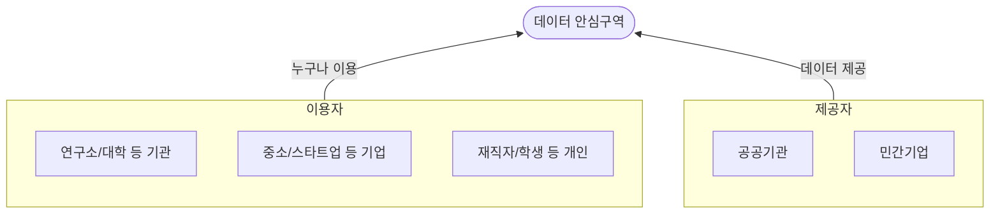
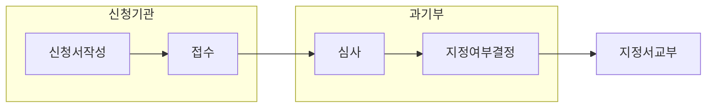

## 데이터 안심구역 개념

- 누구든지 데이터를 안전하게 분석ㆍ활용할 수 있도록 유용한 데이터와, 다양한 분석도구 및 수준 높은 분석 시스템을 제공하는 안전한 데이터 분석 공간
- 보안강화 / 무결성,신뢰성 확보 / 규제 준수, 감사 및 컴플라이언스 / 개인정보 보호, 디지털 격차 해소

## 데이터 안심구역 개념도, 주요 기능, 지정요건

### 데이터 안심구역 개념도

- 사용을 원하는 누구에게나 분석에 필요한 데이터, 환경, 서비스 및 지원 제공

### 데이터 안심구역 주요 기능

| 구분 | 기능 | 설명 |
|---|---|---|
| 데이터 분석 | 미개방 데이터의 안전한 분석환경 제공 | 데이터의 무결성, 신뢰성을 보장할 수 있는 기술적, 관리적, 물리적 보안 조치 시행 |
| | 데이터 분석 시스템 및 도구의 지원 | 미개방 데이터 분석을 위한 분석도구 및 분석자원 서비스 제공 |
| 데이터 활용 | 이용자의 반입자료와 미개방 데이터의 연계 지원 | 미개방 데이터와 이용자의 반입자료에 대한 데이터 연계 플랫폼 제공 |
| | 분석결과의 반출 지원 | 이용자의 데이터 분석결과에 대한 자료 반출 및 데이터 시각화 지원 |

### 데이터 안심구역 지정요건

| 구분 | 지정요건 | 설명 |
|---|---|---|
| 기술적 | 시설 및 공간 | 보안대책 구비될 수 있는 건물 또는 그 밖의 시설 필요|
| 기술적 | 장비 및 시스템 구축 | 데이터 분석 활용을 위해 필요한 장비 및 시스템 등을 구축 및 운영 |
| 운영적 | 보안 대책 수립 및 시행 | 데이터안심구역에 관한 보안대책 수립 |
| | 조직 구성 및 운영 | 운영책임자, 보안책임자 선임, 4인 이상의 조직 |
| | 정책 및 절차 | 운영체계, 데이터 반출의 정책 필요 |
| | 요건 증명 | 최근 3년 이내에 데이터산업법 시행령에 공표된 적 없을시 |
