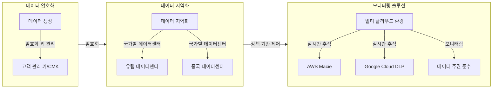

## 데이터 주권 개념

- 특정 국가 내에서 데이터가 저장, 처리, 관리되어야 한다는 규제를 준수하는 것
- CCPA(미국), GDPR(유럽), 데이터 보안법(중국) 등 데이터 저장/처리 위치 제한 조건을 만족하기 위해 멀티클라우드 환경 사용

## 데이터 주권 개념도, 주요 도전 과제

### 데이터 주권 개념도

- 멀티 클라우드를 사용하면서 데이터 이동 및 복제 관리 복잡성 증가

### 데이터 주권 관련 주요 도전 과제

| 도전 과제 | 설명 | 예시 |
| --- | --- | --- |
| 국가별 데이터 규제 | 각국의 데이터 보호 법률 준수 필요 | EU GDPR, 중국 데이터 보안법 |
| 데이터 위치 관리 | 데이터가 저장/처리되는 위치 파악 어려움 | 다국적 기업의 데이터 이동 관리 |
| 복잡성 증가 | 멀티 클라우드 환경에서 데이터 관리 복잡성 | 데이터 이동 및 복제로 인한 위험 |

## 데이터 주권 확립 방안, 확립 사례

### 데이터 주권 확립 방안

| 접근 방안 | 설명 | 예시 |
| --- | --- | --- |
| 데이터 지역화 | 특정 국가 내 데이터 저장 및 처리 전용 인프라 구축 | Microsoft Azure 지역 데이터센터 |
| 데이터 암호화 | 데이터 암호화 적용 및 고객이 직접 키를 관리하는 방식(CMK) 활용 | AWS KMS, Azure Key Vault |
| 정책 기반 제어 | 데이터 저장 및 이동을 정책 기반으로 자동 제어 | Terraform, Kubernetes |
| TEE 활용 | 데이터가 처리 중에도 암호화 상태를 유지하는 환경 제공 | Intel SGX, AMD SEV |
| 모니터링 솔루션 | 데이터 위치 및 이동 실시간 추적 | AWS Macie, Google Cloud DLP |

### 데이터 주권 확립 사례

| 산업 | 적용 방법 | 효과 |
| --- | --- | --- |
| 금융 | 지역별 데이터 분리 저장 | HSBC의 Azure 및 AWS 병행 활용 |
| 헬스케어 | GDPR 준수 데이터 처리 | 유럽 내 환자 데이터 처리 |
| 공공기관 | 대구 클라우드데이터센터 활용 | 민감한 데이터 보호 및 규제 준수 |
