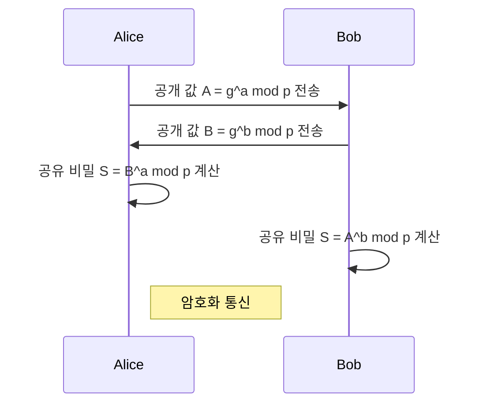

## 디피-헬만 알고리즘 개념

- 안전하지 않은 채널을 통해 암호키를 안전하게 교환할 수 있도록 하는 비밀키 교환 알고리즘
- 인터넷과 같은 중개 네트워크 환경에서 안전한 키 교환 가능

## 디피-헬만 알고리즘 개념도, 절차, 활용사례

### 디피-헬만 알고리즘 개념도

### 디피-헬만 알고리즘 절차

| 절차 | 내용 | 비고 |
| --- | --- | --- |
| 설정 | 두 사용자는 큰 소수 P와 정수 G 선택 | 사전 교환 |
| | 비밀키 a, b를 각각 선택 | 비밀키 설정 |
| 공개값 교환 | 공개값 A, B 나머지 연산 | 안전하지 않은 NW 활용 |
| | 두 사용자는 공개값 교환 | |
| 비밀키 계산 | 서로의 공개값으로 비밀키 나머지 연산 후 암호화 통신 | 대칭키 기반 통신 |

### 디피-헬만 알고리즘 활용사례

| 구분 | 내용 | 비고 |
| --- | --- | --- |
| VPN | VPN 연결시 세션 키교환 수행 | 비대칭 키 교환 |
| TLS | HTTPS 기본 프로토콜인 TLS 키교환시 사용 | ECDHE |
| 무선보안 | WPA/WPA2 등 무선 보안 프로토콜에 활용 | 도청 방지 |

## 디피-헬만 알고리즘 고려사항

- 보안을 위해 충분히 큰 키(2048bit 이상)를 사용하여 무차별 연산 공격 방지
