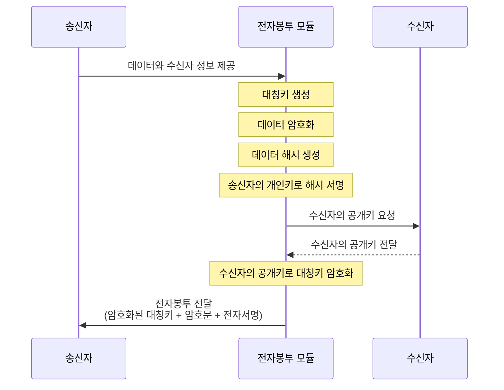
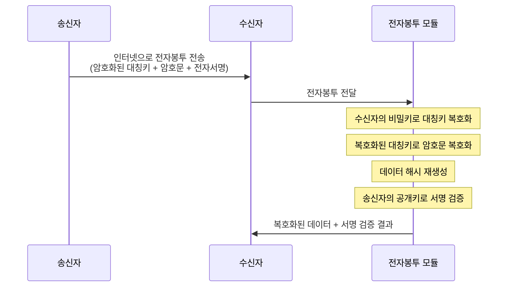

## 전자봉투 개념

- 비밀키를 수신자의 공개키로 암호화하여 전송한 뒤 평문을 암호화하여 온라인에서 기밀성을 보장하는 암호화 기술
- 승인된 사용자만 메시지 복호화 가능 / 무결성, 부인방지 지원 / 대칭키 암호화

## 전자봉투 생성 매커니즘, 개봉 절차, 핵심 기술

### 전자봉투 생성 매커니즘

- 수신자의 공개키로 비밀키를 암호화한 전자봉투를 전송

### 전자봉투 개봉절차

- 전자봉투를 통해 전자서명의 위조불가, 부인방지, 서명자 인증, 변경불가, 재사용 불가와 함께 기밀성 제공

### 전자봉투 핵심 기술

| 기술 | 설명 | 알고리즘 |
|---|---|---|
| 해시함수 | 단방향성과 충돌회피성을 활용하여 고정 길이의 메시지 다이제스트를 생성하는 방식 | MD5, SHA-256 |
| 대칭키 암호화 | 동일한 키(비밀키)를 이용해 암호화 및 복호화를 수행하는 방식 | DES, ARIA, SEED |
| 비대칭키 암호화 | 공개키와 비밀키를 이용해 서로 다른 키로 암호화와 복호화를 수행하는 방식 | RSA, 디피헬만 |
