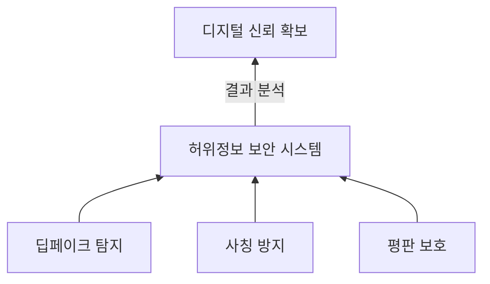

## 허위정보 보안 개념

- 허위정보 보안은 딥페이크 탐지, 정보의 진위성 검증, 조직과 개인의 신원 및 평판 보호를 목표로 하는 기술과 프로세스
- 허위 정보가 기업, 개인, 사회에 미치는 부정적 영향을 최소화하고 디지털 신뢰를 확보하기 위한 필수 보안 체계

## 허위정보 보안 구성도, 공격유형, 활용분야

### 허위정보 보안 구성도

### 허위정보 보안 공격유형

| 공격유형 | 설명 | 주요 사례 |
| --- | --- | --- |
| 딥페이크 확산 | 합성 미디어를 통해 허위 정보를 퍼뜨림 | 음성 및 영상 딥페이크로 인한 금융 사기 |
| GenAI 기반 대규모 허위 정보 생성 | 대량의 허위 정보를 빠르게 생성 | 소셜 미디어를 통한 정치적 내러티브 조작 |
| 피싱 및 사칭 | 설득력 있는 피싱 이메일 및 브랜드 사칭 | 기업 임원을 가장한 피싱 공격 |
| 협업 도구 악용 | 인력 협업 도구의 취약점을 활용 | 콜센터 시스템 취약점 악용 |

### 허위정보 보안 대응방안

| 구분 | 대응방안 | 설명 |
| --- | --- | --- |
| 관리적 | 정책 및 거버넌스 구축 | 조직 내 허위정보 대응을 위한 정책과 절차를 수립하여 명확한 책임 분담과 일관된 대응 체계를 구축 |
| | 사용자 교육 및 인식 제고 | 허위정보, 딥페이크 탐지 기술 등에 대한 교육 프로그램을 통해 보안 인식 수준을 향상 |
| | 협업 체계 구축 | IT, 홍보, 법무 등 부서 간 협력을 강화하여 조직적 대응 속도를 높임 |
| 물리적 | 보안 인프라 강화 | 데이터센터와 서버 접근 제어를 강화하여 물리적 침입 및 데이터 유출을 방지 |
| | 생체 인증 도입 | 얼굴, 음성, 지문 등의 생체 정보를 활용한 인증 체계로 사칭 및 공격을 방지 |
| | 콜센터 보안 강화 | 콜센터 시스템의 취약점을 점검하고 보호 조치를 통해 내부 시스템 악용 방지 |
| 기술적 | 딥페이크 탐지 기술 | 합성 미디어 탐지를 위한 AI와 디지털 포렌식 도구를 활용하여 허위정보를 조기 탐지 |
| | 실시간 모니터링 | 소셜 미디어 및 다크웹의 활동을 감시하여 허위정보 확산을 방지 |
| | 피싱 이메일 차단 | GenAI 기반의 피싱 이메일을 탐지 및 차단하여 이메일 보안을 강화 |
| | 데이터 검증 도구 | 청구 및 문서를 검증하는 알고리즘과 소프트웨어로 허위정보 기반 사기를 예방 |

## 허위정보 보안 강화시 고려사항

- 허위정보의 위험성과 탐지 기술에 대한 실무자 교육을 통해 개개인의 대응 역량 강화 필요
