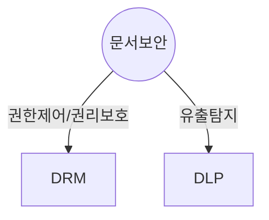

## 문서보안의 개념

- 기업의 문서 보안을 위해 유출탐지를 위한 DLP와 권한/권리제어를 하는 DRM 솔루션 사용

## DRM, DLP 비교

### DRM, DLP 개념비교

| 구분 | DRM | DLP |
| --- | --- | --- |
| 개념도 | 문서 --- 문서유출 --- 열람불가 | 문서 --- 다양한 외부 업로드 경로 --- 차단/감지 |
| 개념 | 디지털 콘텐츠의 생성과 이용까지 유통 전 과정에 걸쳐 안전한 권한에만 정보를 보이게 통제하는 보안 기술 | 기업 내부 민감정보 및 개인정보 등의 데이터 유출을 방지하기 위해 데이터 흐름을 감시하는 보안 기술 |

### DRM, DLP 상세비교

| 구분 | DRM | DLP |
| --- | --- | --- |
| 동작방식 | 각 문서단위 권한 제어 | 데이터 분류 및 유축 탐지 |
| 암호화 | 문서 암호화 | 암호화 없음 |
| 적용 | 사용자 권한 레벨 정의, 문서 생성자 권한 부여 | 데이터 유출 경로, 이메일, 첨부파일 업로드 |
| 목적 | 문서 유출시 기밀성 보장 | 문서 유출 차단 |
| 예시 | 문서 DRM, 멀티미디어 DRM | 네트워크 DLP, 엔드포인트 DLP |
