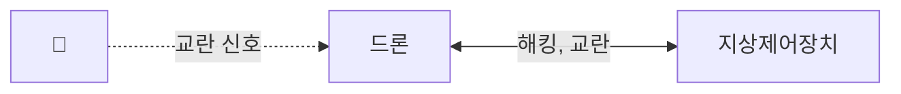

## 드론 보안위협 개념

- 드론 외부의 악의적 행위로 인해 드론 자체 또는 드론이 수집하는 데이터가 탈취, 변조, 파괴 되는 등 드론 운동에 악역향을 주는 모든 위협
- 드론 서비스 활성화에 따라 보안 위협 대책 요구 증가

## 드론 보안위협의 개념도, 주요 유형, 대응방안

### 드론 보안위협의 개념도

- 드론 센서, 구동부와 제어 네트워크 해킹, 교란부 위협

### 드론 보안위협의 주요 유형

### 드론 보안위협의 대응방안

## 드론 보안위협 고려사항

- 드론의 SW와 펌웨어를 정기적으로 업데이트하여 최신 보안 위협 대비 필요
