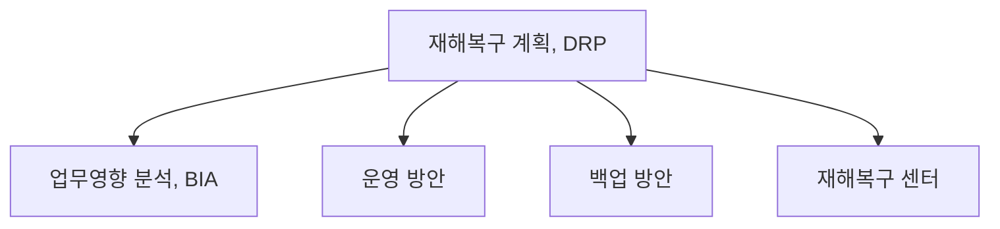
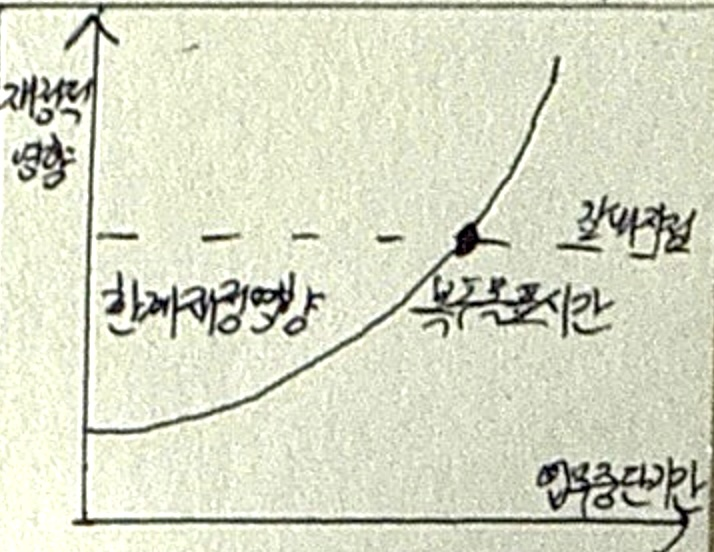
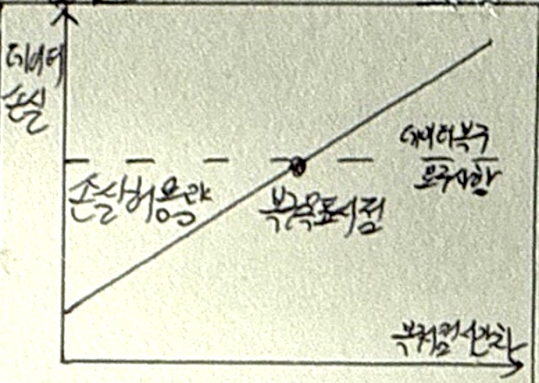

## DRP 개념

- ==재해나 재난 발생 시 정보 시스템과 중요 업무 기능의 신속한 복구를 목표로 하는 계획==으로 ==데이터 손실을 방지==하고, ==시스템 다운타임을 최소화==
- ==비지니스 연속성 유지==, ==데이터 보호==, ==법적 요구사항 준수==, ==재정 손실 최소화==

## DRP 개념도, 핵심요소, 재해복구센터 구성방안

### DRP 개념도

### DRP 핵심요소

| 구분 | 내용 | 비고 |
|---|---|---|
| ==업무영향 분석== | 재해가 비즈니스에 미치는 영향을 분석하는 프로세스 | 복구 우선순위 및 목표 설정 포함 |
| ==운영 방안== | 조직체계, 평상시 운영 절차, 재해 시 운영 절차, 모의 훈련 절차 포함 | 자원 관리 표준 및 절차 포함 |
| ==백업 방안== | 데이터 및 시스템 백업 방안 수립 | ==Hot Standby, DB Shadowing, 원격 백업== 등 |
| ==재해복구 센터== | 백업센터 운영 형태 및 기술 형태 결정 | 백업센터 위치 및 운영 방식 고려 |

### 재해복구센터 구성방안

| 구분 | 내용 | 비고 |
|---|---|---|
| ==백업센터 유형 결정== | 자체센터, 외부위탁, 공동이용, 상호이용 등 백업센터 유형 결정 | 구축 비용, 운영 효율성, 복구 목표 시간 고려 |
| ==데이터 백업 방식== | 데이터 백업 방식 및 범위 결정 | HW 솔루션 또는 SW 백업 방식 선택 |
| ==통신 회선 및 시설== | 통신 회선 사용료, 시설 유지비 등 고려 | HW 도입 및 유지 비용 포함 |
| ==비용 산정== | 구축 시 소요 비용 비교 | 유형별 비용 산정 |

## 재해복구 핵심 지표

| 구분 | RTO | RPO |
| --- | --- | --- |
| 개념도 |  |  |
| 개념 | 서비스 재개를 위한 목표복구시간 | 목표복구시점의 데이터손실의 허용 범위 |
| 영향 | 고객 서비스 지속성, 수익에 직접 영향 | 데이터 무결성, 업무 연속성 |
| 예시 | 금융 ~2h, 일반 ~1d | 금융: 0, 일반: ~1d |

## 재해복구센터 운영형태, 기술형태, 구축전략

### 재해복구센터 운영형태

| 구분 | 내용 | 비고 |
|---|---|---|
| 독자 구축 | 자체적으로 백업센터 구축 및 운영 | 보안 용이, 고가 투자 및 운영 비용 소모 |
| 공동 이용 | 공동으로 백업센터 구축 | 비용 절감, 보안 이슈 |
| 상호 이용 | 기업 간 상호 백업센터 역할 수행 | 비용 절감 가능, 절차 협의 어려움 |
| 외부 위탁 | 외부 전문 업체에 백업센터 운영 위탁 | 비용 절감, 보안 및 데이터 관리 이슈 |

### 재해복구센터 기술형태

| 구분 | 내용 | RTO | RPO | 비고 |
|---|---|---| --- | --- |
| ==Mirror Site== | 실시간 데이터 복제 및 동기화 | ~2h | 0 |높은 비용, 완전한 데이터 복구 가능 |
| ==Hot Site== | 주요 시스템과 데이터를 즉시 사용 가능하게 유지 | ~1d | 약 0 | 빠른 복구, 높은 유지 비용 |
| ==Warm Site== | 필요한 자원과 데이터를 일부 준비 | 수일~수주 | 90% | 복구 시간 길지만 비용 절감 |
| ==Cold Site== | 최소한의 자원만 준비, 필요 시 추가 설치 | 수주~수개월 | 50% |비용 절감, 복구 시간 길어짐 |

### 재해복구센터 구축전략

| 구분 | 고려사항 | 설명 |
|---|---|---|
| 비즈니스 측면 | 비용효율성 | 구축 비용 고려, 기업 목표와 환경에 맞는 방안 선택 |
| | 가치중심성 | 기업 가치를 높일 수 있는 방안 마련 |
| | 안정성 | BIA, RA를 통한 우선순위 도출 |
| 자원 측면 | 상호운영성 | 기존 시스템과의 호환성 고려 |
| | 복구용이성 | 복구 시간, 복구율을 높이기 위한 방안 마련 |
| | 확장성 | 향후 시스템 확장을 고려한 URS 구축 |

## 재해복구 전략 수립시 고려사항

- ==복구 시간(RTO), 복구 지점(RPO), 복구 범위(RSO), 커뮤니케이션(RCO), 복구 센터(BCO)==를 모두 고려한 재해복구 전략 수립 필요
