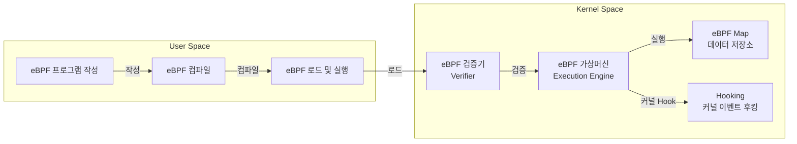

## eBPF 개념

- 전통적인 커널 모듈 대신 동적으로 로드되는 방식으로 작동하여 커널 수준에서 안전한 코드를 실행할 수 있도록 설계된 고성능 기술
- 네트워크 모니터링, 보안, 침입탐지, 성능 최적화

## eBPF 개념도, 핵심요소, 활용사례

### eBPF 개념도

- 커널과 사용자 공간 간 컨텍스트 스위칭을 줄여 성능 최적화 및 코드 실행을 동적으로 업데이트할 수 있어 변화하는 요구에 신속히 대응 가능

### eBPF 핵심요소

| 기능 | 설명 | 비고 |
| --- | --- | --- |
| 커널 내 코드 실행 환경 | 커널 공간에서 사용자 정의 코드 실행 | 유연성, 고성능 |
| 검증기(Verifier) 활용 | 무한 루프 방지 및 메모리 접근 검증 | 안정성 확보 |
| 네트워크 패킷 분석 | 트래픽 모니터링 및 패킷 필터링 | DDoS 탐지 |
| 시스템 이벤트 후킹 | 시스템 호출, 커널 이벤트 후킹 | 침입 탐지(IDS) |

### eBPF 활용사례

| 구분 | 활용 사례 | 설명 |
| --- | --- | --- |
| 네트워크 보안 | DDoS 공격 방지 | 악성 트래픽을 실시간 탐지 및 차단 |
| 침입 탐지 | Falco 기반 침입 탐지 | 컨테이너 내 이상 행위 탐지 |
| 랜섬웨어 방지 | 파일 접근 패턴 모니터링 | 랜섬웨어 암호화 탐지 및 차단 |
| 애플리케이션 보안 | 특정 애플리케이션 트래픽 필터링 | 악성 앱 탐지 및 방어 |

## eBPF 도입시 고려사항

| 도전 과제 | 문제점 | 해결 방안 |
| --- | --- | --- |
| 개발 복잡성 | eBPF 프로그램 작성 및 디버깅이 어렵고 전문 기술 요구 | eBPF 전용 개발 도구 및 문서화 강화 |
| 운영체제 의존성 | 최신 Linux 커널에서만 활용 가능, 타 OS 지원 부족 | eBPF를 지원하는 OS 확장 연구 진행 |
| 보안 검증 의존성 | 검증기(Verifier)의 성능이 보안성 좌우 | Verifier 강화 및 정적 분석 도구 활용 |
