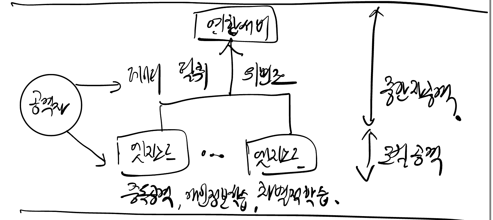

## 연합학습 개념

- 분산된 개별 장치에서 로컬 학습을 수행한 후 모델 업데이트만 공유하여 글로벌 모델을 생성하는 기법
- 데이터 송수신 및 모델 업데이트 공유 과정에서 보안 위협 발생 존재, 이를 보완하기 위한 보안 강화 기법 필요

## 연합학습 데이터 보안 위협 및 강화 기법

### 연합학습 데이터 보안 위협 개념도

### 연합학습 데이터 보안 위협

| 구분 | 보안 위협 | 설명 |
| --- | --- | --- |
| 중간자 공격 | 모델 업데이트 도난 | 공격자가 모델 업데이트를 탈취하여 민감한 데이터를 역추적하거나 모델 성능 저하 유발 |
| 노드 공격 | 중독 공격 | 공격자가 잘못된 데이터를 삽입하여 글로벌 모델 왜곡 |
| 데이터 편향 | 차별적 성능 문제 | 일부 참여자의 데이터가 학습되지 않아 특정 그룹의 예측 성능 저하 |
| | 개인정보 학습 | 개인정보, 민감정보를 그대로 학습하여 글로벌 모델 업데이트 |

### 연합학습 데이터 보안 강화 기법

| 구분 | 보안 기법 | 내용 |
| --- | --- | --- |
| 개인정보 보호 | 차분 프라이버시 | 모델 업데이트에 노이즈를 추가하여 민감 정보 보호 |
| 암호화 보안 | TLS 및 동형 암호화 | TLS를 통한 데이터 전송 보안, 동형 암호화를 활용한 암호화 상태 학습 |
| 실행 환경 보안 | 신뢰할 수 있는 실행 환경(TEE) | CPU 내 격리된 공간에서 학습 수행하여 외부 접근 차단 |
| 모델 무결성 보장 | Byzantine Fault Tolerance(BFT) | 악의적 업데이트를 탐지 및 배제하여 글로벌 모델 품질 유지 |
| 노드 신뢰성 확보 | AI 기반 참여 노드 검증 | K-평균 클러스터링을 활용하여 비정상적 업데이트 탐지 |
