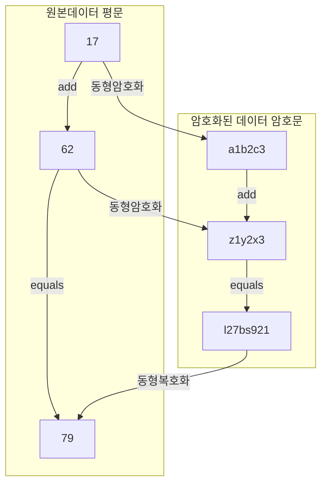

## 동형암호 개념

- 암호화된 데이터를 복호화하지 않고 연산을 수행할 수 있기에  민감한 데이터의 기밀성을 유지하면서 클라우드 컴퓨팅, 빅데이터 분석 등 외부 연산 처리가 가능한 암호화 기법
- 서킷 프라이버시: 연산 진행시 연산에 대한 정보를 알지 못하는 성질 / 다중 도약 동형성: 생성된 암호문이 다른 동형 연산의 입력으로 사용가능한 성질 / 기밀성, 연산효율성, 연산가능성

## 동형암호 동작원리, 기술요소, 유형

### 동형암호 동작원리

- 평문의 연산 결과 값과 암호화된 상태에서의 연산 결과 값은 동일

### 동형암호 기술요소

| 구분 | 기술요소 | 설명 |
|---|---|---|
| 구현 원리 | 부분 동형 암호 (SHE) | 덧셈과 곱셈 모두 지원, 곱셈은 제한된 횟수까지만 가능 |
| | 스퀴싱 (Squashing) | 복호화 알고리즘을 단순화하여 연산 효율성 개선 |
| | 부트스트래핑 (Bootstrapping)| 암호문을 재암호화하여 무한 연산 가능, 노이즈 감소 지원 |
| 특성 | 서킷 프라이버시 | 연산 중에도 연산 내용이나 입력값 노출 방지 |
| | 다중 도약 동형성 | 한 번 암호화된 데이터로 여러 연산을 수행 가능 |
| | 보안성 | 암호문 상태로 연산이 진행되어 데이터 기밀성 보장 |

### 동형암호 유형

| 유형 | 설명 | 특징 |
|---|---|---|
| 부분 동형암호 | 덧셈이나 곱셈 중 한 가지 연산만 지원 | 연산 제약, 계산 비용 낮음 |
| 전 동형암호 | 덧셈과 곱셈 모두 무제한 지원 | 일반적, 연산 속도 느림, 자원 소모 큼 |
| 준 동형암호 | 제한된 횟수의 연산을 지원 | 연산 횟수 제한, 효율적, 실용적 |

## 동형암호 기술동향

| 분류 | 주요 내용 | 활용 사례 |
|---|---|---|
| 암호화 기술 개선 | 전 동형암호의 복잡도를 낮추고 실시간 연산 가능성을 높이는 연구 | 클라우드 데이터 보호 |
| 표준화 노력 | ISO 및 IEEE에서 동형암호 표준화 작업 진행| 의료, 금융 등 산업별 표준 수립 |
| 산업적 활용 확대 | 암호화된 데이터 처리 기술을 클라우드 및 AI 환경에 적용 | 의료 데이터 분석, 금융 데이터 연산 |
