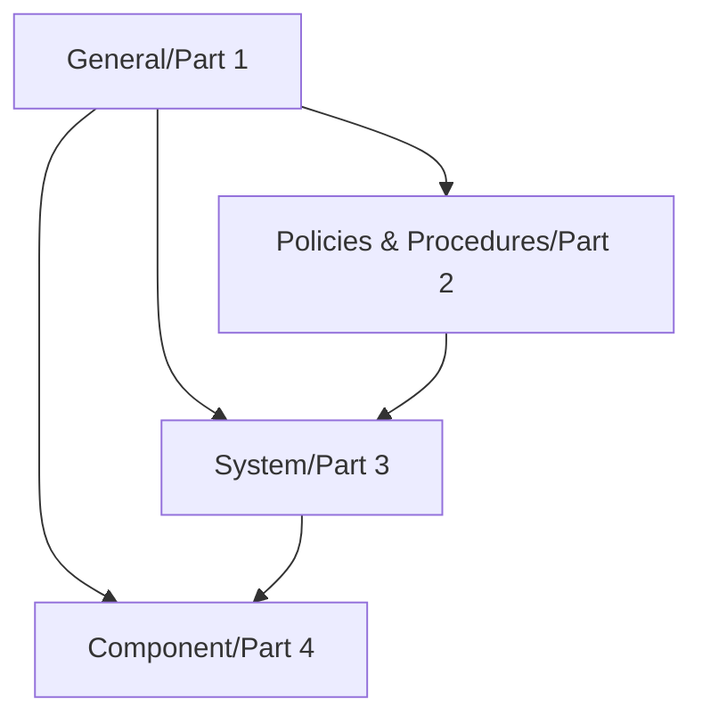

## IEC 62443 개념

- 산업제어시스템(IACS) 보안관리 요구사항과 보안기술, 제품의 개발 요구사항 및 구성요소에 대한 기술적 보안 요구사항 등이 정의되어 있는 산업제어시스템 보안 국제 표준
- 스마트팩토리, 에너지 관리, 공공 인프라의 실시간 데이터 처리와 안정적 운영, 제어시스템 보안을 위해 필요

## IEC 62443 구성도, 구성요소, 보안안정성기준

### IEC 62443 구성도

### IEC 62443 구성요소

| 구분 | 항목 | 내용 |
|---|---|---|
| General (Part 1) | 용어 정의, 개념, 모델 | 7가지 FR(Foundational Requirements) 정의: 식별 및 인증(FR1), 사용자 제어(FR2), 시스템 무결성(FR3), 데이터 기밀성(FR4), 제한된 데이터 흐름(FR5), 이벤트 대응(FR6), 자원 가용성(FR7) |
| | 용어 및 약어 사전 | IACS 보안에서 사용하는 용어와 약어의 정의 제공, 마스터 용어집 작성 |
| | 시스템 보안 적합성 측정 | IACS의 보안 적합성을 측정할 수 있는 기준과 메트릭 정의 |
| Policies & Procedures (Part 2) | 보안 프로그램 수립 | 사이버 보안 관리 시스템 구축을 위한 정책, 운영 절차 정의 |
| | 보안 관리 가이드 | 보안 관리 시스템의 설계, 구현, 운영, 유지보수 가이드를 제공 |
| | 환경 패치 관리 | IT 환경과 다른 IACS 보안 패치 관리 요건 기술 |
| System (Part 3) | 보안 기술 및 시스템 설계 | IACS 설계 및 유지보수 시 필요한 보안 기술과 요구사항 정의 |
| | 네트워크 및 데이터 보안 | IACS 네트워크 및 데이터 흐름의 보안 목표와 구현 방식 정의 |
| | 위험 관리 및 요구 사항 | 시스템 운영 중 발생할 수 있는 위험 요소를 식별하고, 이에 대응하기 위한 요구 사항 정의 |
| Component (Part 4) | 제품 보안 개발 요구 사항 | 보안개발생명주기(SDLC) 요구 사항 및 제품 설계에 따른 보안 기술 정의 |
| | IACS 컴포넌트 요구 사항 | 7가지 FR에 기반하여 각 컴포넌트의 구체적인 보안 요구 사항 제시 |

### IEC 62443 보안안정성기준

| 레벨 | 설명 | 비고 |
|---|---|---|
| SL 1 | 무의도적 위협에 대한 보호 | 인적 오류로 인한 시스템 오작동 방지 |
| SL 2 | 의도적이지만 단순한 위협에 대한 보호 | 저숙련 해커의 단순 공격 방지 |
| SL 3 | 의도적이고 복잡한 위협에 대한 보호 | 숙련된 해커의 정교한 공격 방지 |
| SL 4 | 고도의 의도적이고 복잡한 위협에 대한 보호 | 자원이 풍부한 공격자의 지속적이고 정교한 공격 방지 |
