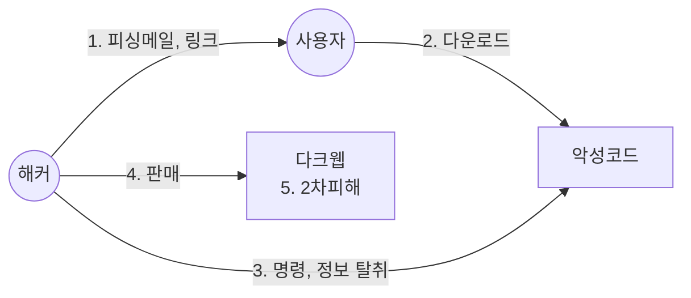

## 인포스틸러의 개념

- 운영체제나 프로그램에 저장된 자격증명과 각종 정보를 훔치는 악성코드
- 암호화폐 지갑, 게임 등 탈취 가능한 자격증명의 증가, 자동화, 지능화된 악성코드 실행

## 인포스틸러의 매커니즘, 공격절차, 대응방안

### 인포스틸러의 매커니즘

### 인포스틸러 공격절차

| 구분 | 내용 | 비고 |
| --- | --- | --- |
| 1. 피싱메일, 링크 접근 | 악성링크 클릭 유도, 불법파일 설치 유도 | 사용자 부주의 이용 |
| 2. 악성코드 실행 | 인포스틸러 SW자동설치 및 실행 | 백신, 방화벽 우회시도 |
| 3. 정보탈취 | 사용자정보, 금융정보, 계정정보 탈취 | C&C서버 활용 |
| 4. 중요정보 판매 | 탈취한 정보를 다크웹 판매, 협박 | 2차 피해 발생 |

### 인포스틸러 대응방안

| 대응방안 | 내용 | 비고 |
| --- | --- | --- |
| 관리적 | 보안정책 수립 및 교육, 강력한 PW, 일회성 PW 사용 | 2차 인증 활성화 |
| 물리적 | 중요 정보 암호화, 디스크 별도 백업 | 정보 유출 피해 최소화 |
| 기술적 | 백신, 침입탐지시스템 등 보안 솔루션 설치, 버전 업데이트 | 주기적인 검사 및 관리 |

## 인포스틸러 고려사항

- 공격의 지능화에 따라 사용자가 신뢰할 수 없는 링크 클릭을 금지하는 등 개인 보안 수칙 준수 필요
