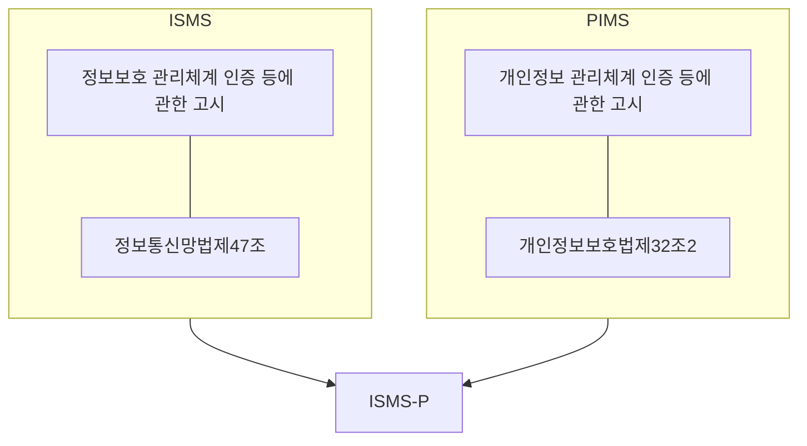

## ISMS, ISMS-P 개념

- 정보통신망법, 개인정보보호법을 근거로 기업 및 기관의 정보보호 및 개인정보보호를 위한 일련의 조치와 활동을 KISA가 증명하는 제도
- 체계적인 관리체계 적용으로 정보보호 및 개인정보관리 수준 향상, 각종 보안 사고시 신속한 대응 가능

## ISMS, ISMS-P 개념도, 구성요소, 적용대상

### ISMS, ISMS-P 개념도

### ISMS, ISMS-P 구성요소 비교

| 구분 | ISMS | ISMS-P |
| --- | --- | --- |
| 인증목적 | 정보보호를 위한 일련의 조치와 활동의 적합성 | 정보보호 및 개인정보보호 위한 조치와 활동의 적합성 |
| 대상조직 | 기존 ISMS 대상 기업, 개인정보 없거나 개인정보 흐름의 보호가 불필요한 기업 | 정보시스템에 개인정보보호 흐름 포함, 개인정보 처리 단계별 보안 강화가 필요한 기업 |
| 심사 항목 | 관리체계 수립 및 운영, 보호대책 요구사항 | 관리체계 수립 및 운영, 보호대책 요구사항, 개인정보처리 단계별 요구사항 |
| 최고책임자지정 | 정보보호 최고 책임자 | 정보보호 최고 책임자, 개인정보보호 책임자 |

### ISMS-P 적용 대상

| 구분 | 대상 | 예시 |
| --- | --- | --- |
| 정보통신망 서비스 제공사 | 서울시, 광역시 에서 정보통신망 서비스를 제공하는 자 등 | 인터넷 사업자, 모바일 사업자 |
| 집적정보통신 시설 사업자 | 정보통신망법 제46조 따른 IDC 사업자 | 서버호스팅 사업자, 보안관제 사업자 |
| 병원 | 연매출 1,500억 이상 상급 종합 병원 | 병상 수, 서비스 기준 3년마다 재평가 |
| 학교 | 연매출 1,500억 또는 전년도 재학생 10,000명 이상 | 대학, 교육대학, 방송통신대학 |
| 정보통신서비스 제공자 | 전년 매출 100억 이상, 전년도 3개월 간 DAU 100만 이상 | 포털, 전자상거래, 금융, 콘텐츠 |

- ==매출 300억 미만 중소기업==, ==매출 300억 이상 주요 정보통신설비 미보유 중기업==은 ==인증 기준 및 비용 40% 절감한 간편 인증== 가능

## ISMS-P 인증 예외 사항

- 정보통신서비스와 관련성이 낮은 ERP, 그룹웨어 등 내부 시스템과 영업, 마케팅 조직은 인증범위 제외
- 금융권 제외
