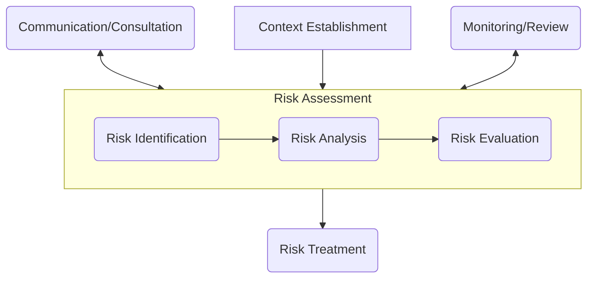

## ISO 31000 개념

- 조직의 효과적인 리스크 관리를 위한 세부 원칙, 프레임워크, 프로세스를 제시하고 가이드라인을 제공하는 국제 표준
- 리스크기반 의사결정 / 조직 회복력 강화 / 조직 목표달성 지원

## ISO 31000 프레임워크, 세부 절차

### ISO 31000 프레임워크

### ISO 31000 세부 절차

| 절차 | 내용 | 설명 |
|---|---|---|
| 의사소통 및 협의 | 조직의 위험 인식에 대한 공유 및 협의 | 조직의 위험 관리 프로세스에서 모든 이해관계자의 참여를 유도 |
| 맥락 이해 | 조직의 운영 현황과 주변 환경에 대한 이해 | 위험 관리의 배경 및 범위를 정의 |
| 위험식별 | 조직의 목표에 위협할 영향을 줄 수 있는 내·외부 사건의 파악 | 위험사건이 어떻게 발생하고 영향을 줄 것인지 분석 |
| 위험분석 | 위험사건의 확률과 피해에 대한 예측 및 위험수용 | 정량적/정성적 분석을 통해 위험의 심각성 평가 |
| 위험평가 | 정책 대응 여부 판단 | 위험등급을 기반으로 직면한 위험 대응 |
| 위험대응 | 위험 발생을 줄이거나 통제하는 행동 | 회피, 전가, 감수, 수용, 이관, 종료 |
| 감독 및 보고 | 모니터링과 평가를 통한 조직 학습 | 위험관리 후 지속적인 평가와 개선 |
