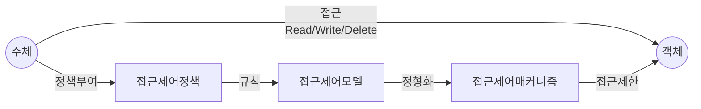

## 접근제어의 개념

- 사용자의 신원을 식별, 인증하여 대상, 정보의 접근 및 사용 수준을 인가하는 관리 기법
- 최소 권한과 직무 분리로 제로 트러스트 기반 기밀성, 무결성 달성을 위해 필요

## 접근제어의 개념도, 주요 유형

### 접근제어의 개념도

### 접근제어의 주요 유형

| 구분 | 내용 | 비고 |
| --- | --- | --- |
| DAC, 임의적 접근제어 | 사용자나 그룹에 근거한 접근제어, 특정 권한 주체가 권한 위임 가능 | ACM, ACL |
| MAC, 강제적 접근제어 | 객체별로 정의된 권한을 근거로 접근제어, 보안등급, 규칙 기반 | 벨라파둘라, 비바, 클락윌슨, 만리장성 |
| RBAC, 역할기반 접근제어 | 권한을 그룹에 부여하고, 그룹이 수행할 역할을 정의하여 접근제어 | IAM 등 |

## LDAP 프로토콜의 개념 및 접근제어 방안

### LDAP 프로토콜의 개념

- 사용자, 시스템, N/W, 어플리케이션 정보를 트리로 저장하여 조회, 수정 등 디렉토리 서비스와 정보를 전달하는 프로토콜
- DAP의 통신비용을 절감하기 위해 표준화

### LDAP 프로토콜의 접근제어 방안

| 구분 | 내용 | 비고 |
| --- | --- | --- |
| 인증 | Bind요청을 통한 사용자, 클라이언트 신원 검증 | 비밀번호, SASL 등 |
| 인가 | LDAP 디렉토리 내 객체와 속성 권한 확인 후 권한 부여 | 사용자, 그룹정보로 ACL 처리 |
| 감사, Audit | LDAP 서버 활동 기록, 보안 및 규정준수 추적 | Audit Log, Change Log 관리 |
