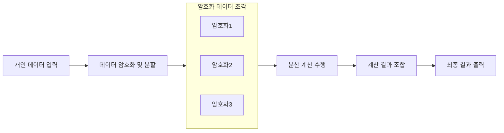

## 다자간 계산 개념

- 여러 참여자가 각자의 비밀 정보를 제공하지 않고도 공동 계산을 수행할 수 있도록 하는 암호학 기법
- 프라이버시 보호, 신뢰 없는 환경에서 협업, 데이터 보안, 확장성

## 다자간 계산 개념도, 핵심요소, 활용방안

### 다자간 계산 개념도

### 다자간 계산 핵심요소

| 구분 | 기술 | 설명 |
|---|---|---|
| 암호화 | 동형 암호화 | 데이터가 암호화된 상태로 연산 가능 |
| | 비밀 분할 | 데이터를 다수의 셰어로 나누어 저장하고, 계산 후 결과 복원. |
| 프로토콜 | Yao’s Garbled Circuit | 안전한 회로 기반의 계산을 수행하며, 효율적 보안 제공 |
| | Threshold Cryptography | 일정 수 이상의 셰어가 합쳐질 때만 계산이 가능 |
| | 블라인드 평가 | 비밀번호 확인 없이 전송, 내용확인 없이 본인이 질문내역 확인 |

### 다자간 계산 활용분야

| 구분 | 내용 | 비고 |
|---|---|---|
| 공공 | 전자 투표 시스템에서 투표자의 익명성을 유지하며 투명한 결과 제공 | 선거 공정성과 신뢰 확보 |
| | 민감한 의료 데이터를 보호하면서 병원 간 협력 연구 수행 | 환자 데이터 보호 및 연구 효율성 강화 |
| 금융 | 암호화폐 지갑에서 개인 키 분산 저장 및 복구 기능 제공 | 키 분실 방지 및 보안 강화 (예: ZenGo, Fireblocks) |
| | 은행 간 신용 평가 및 사기 탐지를 위해 데이터를 비공개 상태로 분석 | 금융 기밀 보호와 협력 가능 |
| 민간 | 경쟁 기업 간 시장 점유율 분석 시 데이터 보호 | 데이터 유출 방지 및 협력 증대 |
| | 블록체인 기반 기업 지갑에서 멀티시그(Multi-Signature) 대체 | 분산 서명으로 보안 및 효율성 향상 |
| | 프라이버시를 강화한 연합 학습으로 AI 모델 학습 | 데이터 보호 상태에서 AI 성능 향상 |
