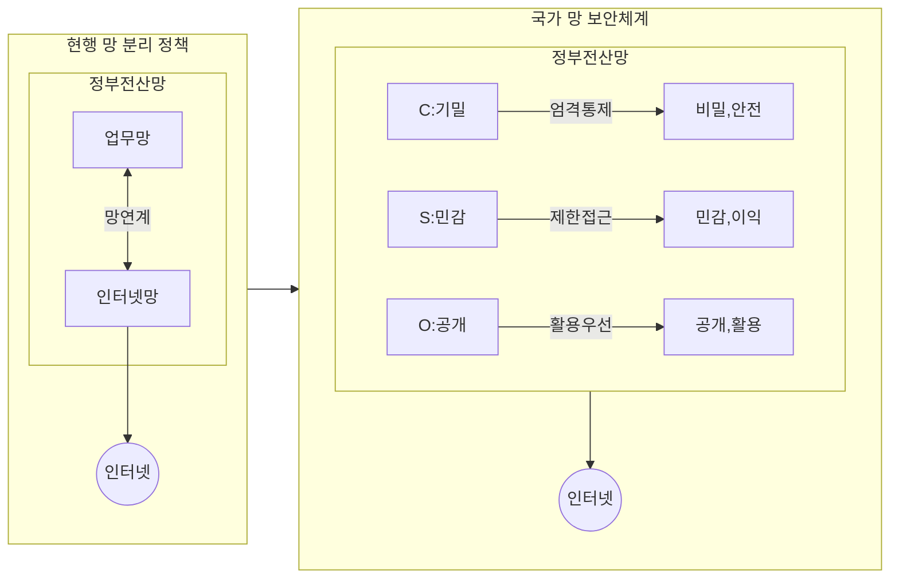

## N²SF 개념

- 국가 보안체계를 망분리 하지 않아도 보안성을 확보하는 것을 목표로 국가 및 공공기관의 정보보안 강화를 위해 도입된 신규 보안 프레임워크
- 기존 망분리 정책의 클라우드, AI 등 신기술과 원격 근무 환경에서의 비효율, 제약 해결, 보안정책 패러다임 전환 / 신기술 융합 강화, 스마트 업무환경 조성 / 공공데이터 활용을 통한 디지털 경제 창출

## N²SF 개념도, 정책 유형, 적용 절차

### N²SF 개념도

### N²SF 정책 유형

| 정책 유형 | 설명 | 비고 |
| --- | --- | --- |
| 제로트러스트 | 사용자와 디바이스를 지속적으로 검증하고, 최소 권한 원칙을 기반으로 접근 통제 | PDP, PEP, PIP |
| MLS(Multi-Level Security) | 데이터와 시스템의 보안 등급을 정의하고, 다단계 보안 정책을 적용 | C/S/O |
| 망분리 완화 | 망분리 정책을 완화하며 보안 통제를 강화하여 업무 연속성과 보안의 균형 확보 | 스마트 업무환경 |

### N²SF 적용 절차

## N²SF와 CSAP 비교

| 구분 | N²SF | CSAP |
| --- | --- | --- |
| 목표 | 국가 및 공공기관의 망 보안을 강화하며 데이터 활용성 증대 | 공공기관 클라우드 서비스의 안전성과 신뢰성 확보 |
| 주요 특징 | 업무 중요도에 따른 등급별 차등 통제 (C/S/O) | 클라우드 서비스 유형(IaaS, SaaS 등)에 따른 보안 인증 |
| 적용 대상 | 국가 및 공공기관 전산망 | 공공기관에서 사용하는 클라우드 서비스 |
| 관리 주체 | 국가정보원 | KISA |
| 보안 접근법 | 위협 식별 및 단계별 보안 대책 수립 | 사전 인증 후 공공기관에 서비스 제공 가능 |
| 유효기간 | 지속적인 평가와 조정 | 인증 후 5년 유효 |

## N²SF 주요 고려사항

- 업무 중요도에 따른 C/S/O 등급 분류
- 제로트러스트 도입 시간 및 비용 고려
