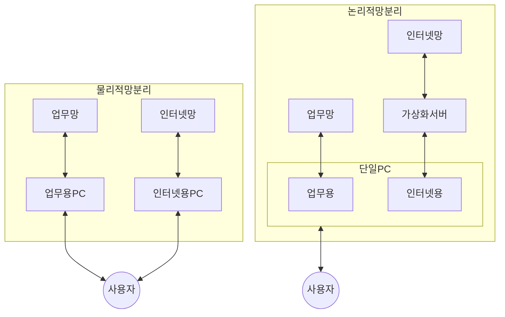

## 망 분리 개념

- 외부망을 통한 불법 접근과 내부 정보 유출을 차단하기 위ㅏ해 내부 엄무망과 외부 인터넷망을 분리하는 망 차단 조치

## 망 분리 구성도, 구성요소

### 망 분리 구성도

### 망 분리 구성요소

| 구분 | 유형 | 설명 |
| --- | --- | --- |
| 물리적 망분리 | PC 이중화 | 업무망, 인터넷망 PC 분리 |
| | 망전환 장치 | 망전환장치를 통해 업무용과 인터넷용 인터페이스 분리 |
| | 폐쇄망 구축 | 중요 정보 처리시 별도 차단 공간에 분리 |
| 논리적 망분리 | SBC | 서버 가상화 통한 인터넷망 분리 |
| | CBC | 사용자의 가상화 영역을 통한 인터넷망 분리 |

- 국가 네트워크 보안 프레임워크 정책을 준수하여 망 분리 달성
