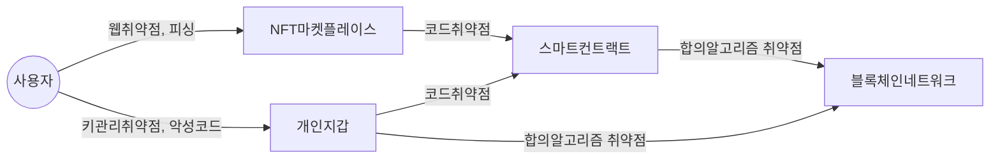

## NFT의 개념

## NFT의 보안 취약점 개념도, 주요 유형, 대응방안

### NFT의 보안취약점 개념도

- NFT생태계의 복잡성으로 인해 다양한 유형의 취약점 존재

### NFT 보안 취약점 주요 유형

| 구분 | 내용 | 비고 |
| --- | --- | --- |
| 플랫폼 취약점 | 마켓플레이스 웹 취약점 | 해킹, 스캠 등 |
| - | 피싱, 사이트, 메일 등 정보 탈취 | - |
| 코드 취약점 | 스마트 컨트랙트 코드 오류, 개인 지갑 확장 프로그램 오류 | 악성코드 감염, 실행 |
| 키관리 | 개인 지갑 비밀번호, 복구구문 탈취 | 권한 상실, 도난 |
| 프로토콜 취약점 | 블록체인 네트워크 합의 알고리즘 결함 | 거래 무효화, 이중 지불 등 |

### NFT 보안 취약점 대응방안

| 구분 | 내용 | 비고 |
| --- | --- | --- |
| 관리적 | 스마트컨트랙트 코드 표준 준수 감사 | ERC-721 |
| - | 신원 인증 강화, 거래소 신뢰도 평가 | 커뮤니티 관리 |
| 물리적 | 개인정보 암호화, 백업시스템 도입 | 데이터 기밀성, 무결성 확보 |
| 기술적 | 소유권 정보 일관성 유지 | 검증시스테 구현 |
| - | 안전한 합의 알고리즘 사용 | 지분증명 |
