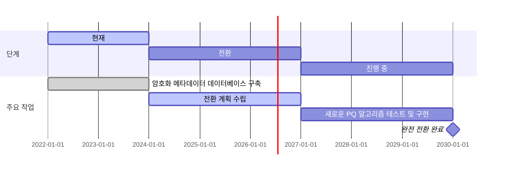
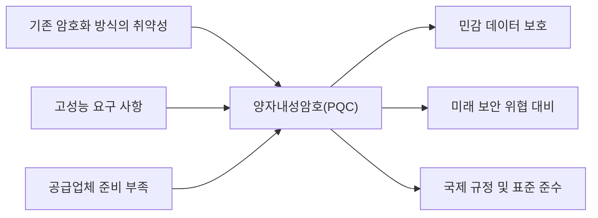

## 양자내성암호 개요

- 양자 컴퓨터의 발전으로 기존 암호화 방식이 깨질 가능성에 대비하여 설계된 암호화 기술
- 데이터 보안의 새로운 패러다임으로, 조직의 민감한 정보 보호와 미래의 사이버 위협 대비 필수

## 양자내성암호 개념도, 유형, 활용방안

### 양자내성암호 개념도

- 기존 인터넷 인프라(TLS/SSL)와 호환되도록 설계되어 도입이 용이

### 양자내성암호 유형

| 유형 | 설명 | 특징 |
| --- | --- | --- |
| ==격자 기반 암호== (Lattice-based Cryptography) | 격자 문제(예: SVP, CVP)를 기반으로 한 암호화 방식 | 강력한 보안성과 다양한 응용 가능성 |
| ==코드 기반 암호== (Code-based Cryptography) | 오류 정정 코드를 활용한 암호 방식 | 오래된 이론적 기반과 높은 내구성 제공 |
| 다변량 ==다항식 암호== (Multivariate Polynomial Cryptography) | 다변량 다항식 방정식을 사용하는 암호화 방식 | 경량 기기 적용 가능, 계산 효율성 우수 |
| 해시 기반 암호 (Hash-based Cryptography) | 암호화에 해시 함수와 그 변형을 사용하는 방식 | 간단하고 안정적인 보안, 디지털 서명에 주로 사용 |
| 아이소제니 기반 암호 (Isogeny-based Cryptography) | 타원 곡선 간의 아이소제니(동형사상)를 이용한 방식 | 키 크기가 작아 리소스 효율적이며, 타원 곡선 문제에 기반 |

### 양자내성암호 활용방안

| 구분 | 활용 방안 | 기대 효과 |
| --- | --- | --- |
| 미래 대비 시스템 보호 | 민감한 금융 데이터를 양자 컴퓨팅 환경에서도 안전하게 유지 | 금융 데이터 보안을 강화하고 장기적 신뢰성 확보 |
| 지적 재산권 보호 | 경쟁자와 해커가 암호화된 기밀 정보를 해독하지 못하도록 보호 | 사이버 위협으로부터 지적 재산권 및 기밀 정보 보호 |
| 운영 데이터 보호 | 암호화된 메시지, 계약, 운영 데이터를 양자 컴퓨팅 기반 공격으로부터 차단 | 데이터 가로채기 및 해독 방지로 조직의 데이터 무결성 유지 |

## 양자내성암호 적용사례, 기술과제

### 양자내성암호 적용사례

| 구분 | 내용 | 비고 |
| --- | --- | --- |
| 공공 | 국가 차원의 민감 데이터를 보호하기 위해 PQC 기술 도입 | 미국 NIST는 PQC 알고리즘 표준화 진행 |
| 금융 | 금융 거래 데이터와 고객 정보를 양자컴퓨터의 위협으로부터 보호 | Visa 결제 데이터 보안 강화 |
| 민간 | 저전력 IoT 장치에서도 효율적으로 작동하며, 네트워크 보안 강화 | Bosch는 IoT 디바이스 통신을 보호하기 위해 PQC 도입 |
| | 환자 기록과 생체 데이터를 양자컴퓨터의 공격에서 보호 |GE Healthcare는 의료 데이터 전송에 PQC 적용 |

### 양자내성암호 기술과제

| 구분 | 내용 | 해결방안 |
| --- | --- | --- |
| 알고리즘의 계산 복잡성 | PQC 알고리즘은 높은 계산량으로 인해 성능 저하 초래 | 경량화 알고리즘 개발과 병렬 처리 기술 도입 |
| 표준화 부재 | 다양한 알고리즘 간 상호운용성과 신뢰성 확보 필요 | 국제 표준화 기구(NIST, ISO)와의 협력을 통한 표준화 진행 |
| 도입 비용 문제 | 기존 시스템의 업그레이드와 전환 비용 부담 | 하이브리드 암호화 방식으로 점진적 전환 |

## 양자내성암호 고려사항

- 양자 컴퓨터가 현재 암호화 표준을 깨뜨릴 수 있을 만큼 강력해지더라도 데이터를 보호할 수 있는 PQC 알고리즘의 점진적인 전환 필요
