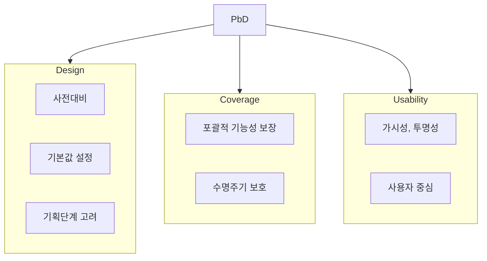

## PbD 개념

- 프라이버시에 대한 위협을 예측/예방하기 위해 SW수명주기 전체에서 사용자 프라이버시 통제권을 보호하면서 시스템의 편리성을 해치지 않도록 설계하는 기법

## PbD 개념도, 7대 기본원칙, 8대 전략

### PbD 개념도

- 프라이버시 위협을 예측하여 서비스 기획/설계 단계에서 사전 예방

### PbD 7대 기본원칙

| 구분 | 원칙 | 설명 |
|---|---|---|
| Design | 사전대비 | 사후 대응이 아닌 사전에 문제점 예방 |
| | 기본값 설정 | 프라이버시 보호를 기본값으로 설정 |
| | 기획단계 고려 | 설계에 프라이버시 보호를 내재화 |
| Coverage | 포괄적 기능성 보장 | 프라이버시 보호와 함께 기능성, 편리성도 확보 |
| | 수명주기 보호 | 기획부터 폐기 단계까지 전체 수명주기 보호 |
| Usability | 가시성, 투명성 | 개인정보처리 과정에 대한 투명성 제공 |
| | 사용자 중심 | 자기정보 통제권 보장, 프라이버시 준중 |

### PbD 8대 전략

| 구분 | 전략 | 내용 |
|---|---|---|
| 데이터지향 | 최소화 | 프라이버시 침해 가능성을 최소화하기 위해 개인정보의 명확한 활용 목적에 따라 처리되는 개인정보 양을 최소화 |
| | 숨기기 | 개인정보가 처리되는 과정에서 평문 전송 등을 방지하여 외부에서 해당 내용을 볼 수 없도록 조치 |
| | 분리 | 개인에 대한 다양한 정보를 분리해 저장하여 하나의 DB에서만 식별되지 않도록 조치 |
| | 총체화 | 많은 양의 개인정보를 처리할 경우 개인이 식별되지 않도록 식별자를 비식별화하고, 처리 결과는 통계 등 총체적인 형태로 제공 |
| 프로세스 중심 전략 | 정보제공 | 개인정보 처리와 전반 과정에 대해 정보 주체가 투명하게 알 수 있도록 제공 |
| | 통제 | 정보 주체가 개인정보 처리 과정과 전반에 대해 자신의 정보에 대한 권리를 행사할 수 있도록 지원 |
| | 집행 | 내부 개인정보보호 정책을 법·제도와 무관하게 강제적으로 시행 |
| | 입증 | 컨트롤을 통해 개인정보보호 정책의 효과적 운영과 법적 준수성 입증 |

## PbD와 개인정보보호원칙 비교

| 구분 | PbD 8대 전략 | 개인정보보호 원칙 |
|---|---|---|
| 개념 | 정보시스템이나 비즈니스 프로세스를 설계하는 초기 단계부터 개인정보보호를 내재화 | 개인정보의 수집, 이용, 제공, 보관 등 모든 단계에서 정보주체의 권리를 보호하고 안전하게 처리 |
| 목적 | 사전예방 | 개인정보 라이프사이클에 대한 보호 |
| 관점 | 기본 설정에 의한 프라이버시 보호 | 적법하고 공정한 개인정보 수집 |
| 접근방식 | 시스템 설계에 통합하여 보호 | 정보주체의 권리 보호 |
| 접근방식 | 개인의 프라이버시 강화 | 기업의 책임과 의무 |
| 범위 | 기술적, 조직적, 법적 측면 종합적 접근 | 법적인 측면에서 개인정보 처리와 보호 |
| 책임과 의무 | 시스템 설계 주체 책임 | 개인정보를 처리하는 주체인 기업이나 기관에게 책임과 의무 부여 |
