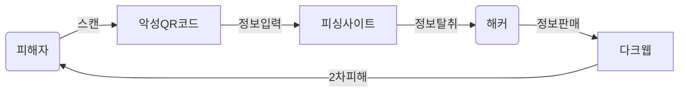

## 큐싱의 개념

- QR Code와 Phishing의 합성어로 QR코드를 활용하여 개인정보, 결제정보 등을 탈취하는 공격 기법

## 큐싱의 개념도, 공격흐름

### 큐싱의 개념도

### 큐싱의 공격 흐름

| 구분       | 내용 | 비고               |
| ---------- | ---- | ------------------ |
| QR코드     | -    | 과금, 결제, 링크QR |
| 피싱사이트 | -    | UI카피, XSS        |
| 해커       | -    | 개인, 범죄조직     |
| 다크웹     | -    | 2차 피해           |

## 큐싱 대응방안

| 구분 | 내용                                   | 비고            |
| ---- | -------------------------------------- | --------------- |
| 공공 | 큐싱 URL 차단                          | DNS 우회        |
| 금융 | 결제시 2차인증, 홍보 강화              | FIDO, 2FA       |
| 민간 | URL 재확인, 신뢰할 수 없는 인증서 확인 | 외부링크 재확인 |

- 큐싱 피해를 줄이기 위해 정부, 기업, 개인의 지속적인 관심 필요
