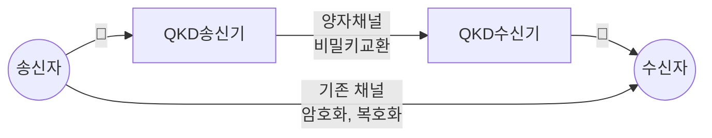

## 양자암호통신의 개념

- 양자역학의 원리를 이용하여 송신자, 수신자 간 비밀키를 안전하게 생성하고 분배하는 통신기술
- RSA 기반 전자봉투 비밀키 교환 방식은 양자컴퓨터의 발달로 해독 가능성 존재, 양자 불확정성 원리로 도,감청시 키가 변형되므로 보안성 우수

## 양자암호통신의 구성도, 구성요소, 적용방안

### 양자암호통신의 구성도

### 양자암호통신의 구성요소

| 구분 | 내용 | 비고 |
| --- | --- | --- |
| 양자키분배기(QKD) | 양자비트 생성 후 비밀키 교환, 양자비트 수신 후 비밀키 측정 | 양자상태 유지, 측정 후 키 생성 |
| 양자 채널 | 양자 비트를 전달하는 통신채널 | 광섬유, 위성 |
| 기존 채널 | QKD 이후 암호문을 송수신하고 복호화하는 채널 | TLS 등 N/W 보안 고려 |

### 양자암호통신의 적용방안

| 구분 | 내용 | 비고 |
| --- | --- | --- |
| 공공 | 국가 기밀 통신 | 높은 보안 수준 요구 |
| - | 군사 통신 | - |
| 금융 | 금융 거래 보호 | 비용 대비 효과 고려 |
| - | 기업 비밀 문서 전송 | - |
| 민간 | 개인정보보호, IoT 보안 | 프라이버시 보호 |

## 양자암호통신 고려사항

- 기술 표준화 부재로 시스템 간 호환성을 고려한 운영비용 산정 필요
