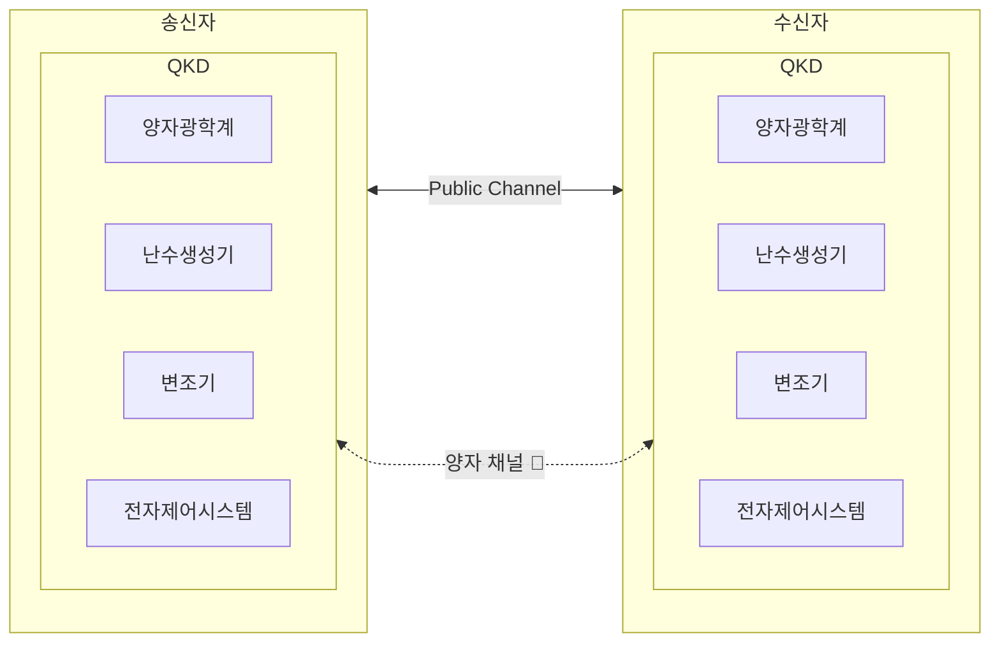

## 양자 키 분배 개념

- 양자암호통신에서 송신자와 수신자에게 실시간으로 양자 키를 안전하게 분배하는 기술

## 양자 키 분배 구성도, 구성요소

### 양자 키 분배 구성도

- 키 분배 장비를 통해 생성된 암호키는 양자채널을 통해 전송, 암호문은 일반 채널로 전송

### 양자 키 분배 구성요소

| 구분 | 구성요소 | 내용 |
| --- | --- | --- |
| 하드웨어 | 양자광학계 | 단일광자 소스, 편광기, 검출기 등 양자 상태를 생성하고 측정하는 장치 |
| | 양자난수생성기 | 예측 불가능한 난수를 생성하여 키 분배에 사용 |
| | 변조기 | 광자의 위상, 편광 등을 변조하여 정보를 인코딩 |
| | 전자제어시스템 | 양자광학계와 변조기의 동기화 및 제어를 담당 |
| | 양자채널 | 비밀키 전송 채널 |
| 소프트웨어 | 프로토콜 | BB84, E91 등 양자 키 분배를 위한 통신 규약 |
| | 구현 방식 | 단방향, 양방향 등 통신 방식 |
