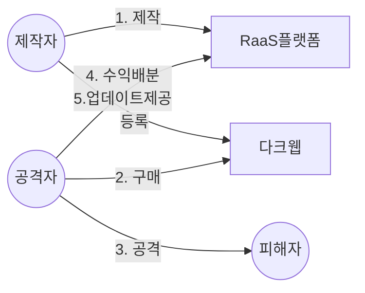

## 랜섬웨어의 개념

- 몸값(Ransome)과 소프트웨어의 합성어로 시스템을 감염시커 사용 불가능한 샅애로 만들거나, 데이터를 암호화해 사용할 수 없게한 뒤 금전을 요구하는 악성프로그램
- 다크웹 등 익명 N/W를 통해 누구나 랜섬웨어를 의뢰, 구매하여 공격에 활용할 수 있는 RaaS 형태로 진화

## RaaS의 매커니즘, 공격절차, 대응방안

### RaaS의 매커니즘

### RaaS의 공격절차

| 구분 | 내용 | 비고 |
| --- | --- | --- |
| 1. 제작, 등록 | RaaS 플랫폼 제작, 다크웹에 광고 | 텔레그램 등 활용 |
| 2. 구매 | 원하는 랜섬웨어 구매, 맞춤형 랜섬웨어 서비스 생성 | 암호화 방식, 금액 등 |
| 3. 공격 | 랜섬웨어를 피싱 메일, 파일, 웹사이트를 통해 유통, 감염 후 금전 요구 | 암호화폐 활용 |
| 4. 수익배분 | 공격자와 제작자의 범죄수익 공유 | RaaS 수수료 |
| 5. 업데이트 제공 | 지속적인 취약점 업데이트 | 제로데이 공격 |

### RaaS 대응방안

| 구분 | 방안 | 비고 |
| --- | --- | --- |
| 관리적 | 보안 인식 교육 강화 | 정기적인 모의 훈련 |
| - | 데이터 백업 정책 수립 | 오프라인 백업 등 |
| 물리적 | 출입 통제 강화 | CCTV, 출입 대장 |
| 기술적 | N/W 보안 강화 | 방화벽, IDS, IPS |
| - | 이메일 보안 강화 | 스팸필터, 파일 검사 |
| - | EDR 솔루션 도입 | 엔드포인트 모니터링 |

## RaaS 고려사항

- 랜섬웨어 피해를 최소화하기 위해선 예방하는 것이 최선이므로, 개인의 사이버보안 생활화 필요
