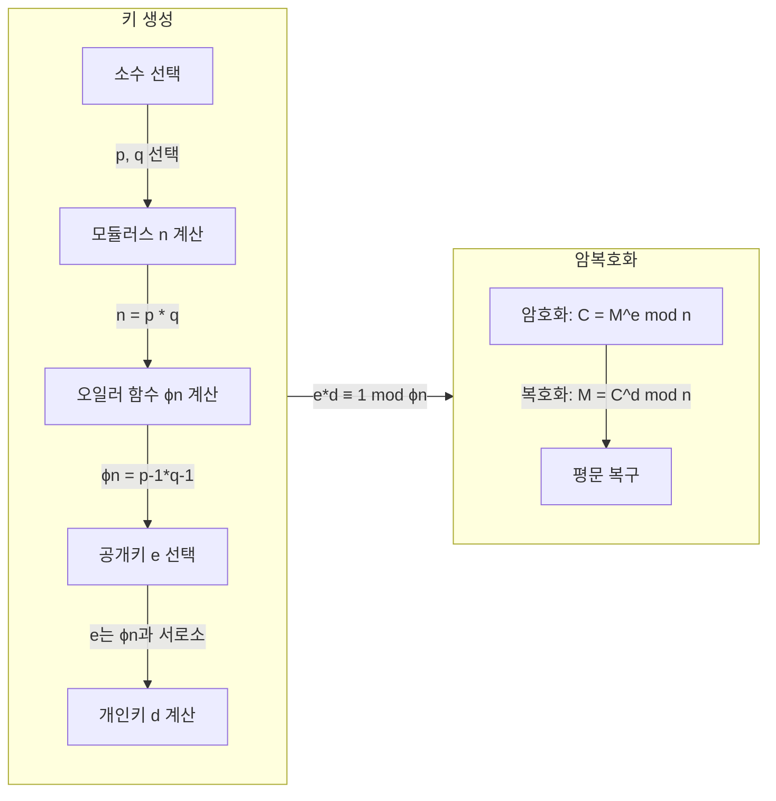

## RSA 암호화 알고리즘 개념

- 소인수분해 문제의 계산적 복잡성을 기반으로 하며, 데이터 암호화 및 디지털 서명을 통해 정보의 기밀성, 무결성, 인증을 보장하는 암호화 알고리즘
- 데이터 기밀성 보장 / 디지털 서명 활용 / 비대칭 키 관리 용이성

## RSA 암호화 알고리즘 동작 매커니즘, 세부절차, 키 역할

### RSA 암호화 알고리즘 동작 매커니즘

### RSA 암호화 알고리즘 세부절차

| 단계 | 설명 | 예시 |
| --- | --- | --- |
| 소수 선택 | 두 개의 큰 소수 p와 q를 선택 | p = 61, q = 53 |
| 모듈러스 계산 | n = p × q 계산 (공개키와 개인키의 공통 기준) | n = 61 × 53 = 3233 |
| 공개키 생성 | 오일러 함수 ϕ(n) 계산 후, ϕ(n)과 서로소인 e 선택 | ϕ(3233) = 3120, e = 17 |

### RSA 암호화 알고리즘에서의 공개키/개인키 역할

| 키 유형 | 역할 | 비고 |
| --- | --- | --- |
| 공개키 | 데이터 암호화 및 디지털 서명 검증 | 누구나 접근 가능|
| 개인키 | 데이터 복호화 및 디지털 서명 생성 | 비공개로 보호 |

## RSA 암호화 알고리즘 한계 및 해결방안

| 한계점 | 세부 내용 | 해결 방안 |
| --- | --- | --- |
| 연산 속도 저하 | 암호화/복호화 연산이 느려 대규모 데이터 처리에 비효율적 | AES와 결합한 하이브리드 암호 시스템 구축 |
| 양자컴퓨팅 위협 | 양자컴퓨팅 기술 발전 시 소인수분해 문제가 해결될 가능성 존재 | 양자내성암호, PQC 도입 |
| 키 길이 증가 | 보안 강화를 위해 키 길이가 지속적으로 증가함 | 효율적인 알고리즘 최적화 및 하드웨어 가속화 |
