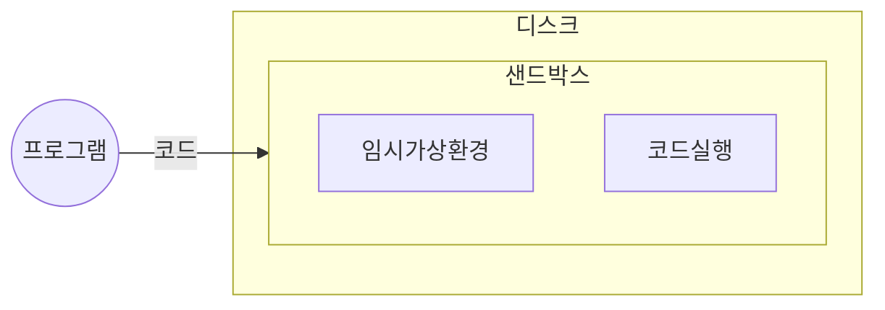

## 샌드박스 개념

- 격리된 가상 환경에서 파일을 실행하고 이상 행위를 감시하여 보안 취약점을 확인하여 내부시스템에 악영향을 주는 것을 방지하는 기술
- 논리적 분리 영역, 악성코드 예방, 악성코드 수행결과 분석

## 샌드박스 구성도, 구성요소

### 샌드박스 구성도

### 샌드박스 구성요소

| 구분 | 내용 | 비고 |
| --- | --- | --- |
| 클래스 로더 | 클래스 로드 여부 검사, 파일 실행 | JVM 환경 |
| 바이트 코드 검사기 | 클래스가 명확한 바이트 코드 포맷인지 검사 | 코드 변조 탐지 가능 |
| 보안관리자 | 신뢰없는 클래스가 보호된 자원에 접근하지 않게 차단 | 파일 접근, 네트워크 사용 제한 |
| | 외부 시스템과 격리된 가상 환경에서 파일 실행 | 가상 실행 환경 제공 |
| | 악성코드 및 의심 파일을 안전 영역(Safe Zone)으로 이동하여 분석 | 악성코드 행동 분석 |

### 샌드박스 활용분야

| 구분 | 활용분야 | 내용 |
| --- | --- | --- |
| 가상 실행 환경 | 애플리케이션 테스트 | 샌드박스 내에서 실행하여 시스템에 영향을 주지 않도록 테스트 |
| SW 보안 | 악성코드 분석 | 의심 파일을 가상 환경에서 실행하여 악성 여부 판단 |
| | 안전 결제 환경 제공 | 온라인 결제 시 악성코드 감염 여부 검사 후 실행 |
| 디바이스 보안 | 사용자 단말 보호 | 악성코드 탐지 및 랜섬웨어 차단 |
| | 모바일 앱 샌드박스 | 앱이 시스템에 미치는 영향을 최소화하고 보안 격리 |
| | 브라우저 샌드박스 | 웹사이트 실행 시 악성 코드 감염 방지 |
