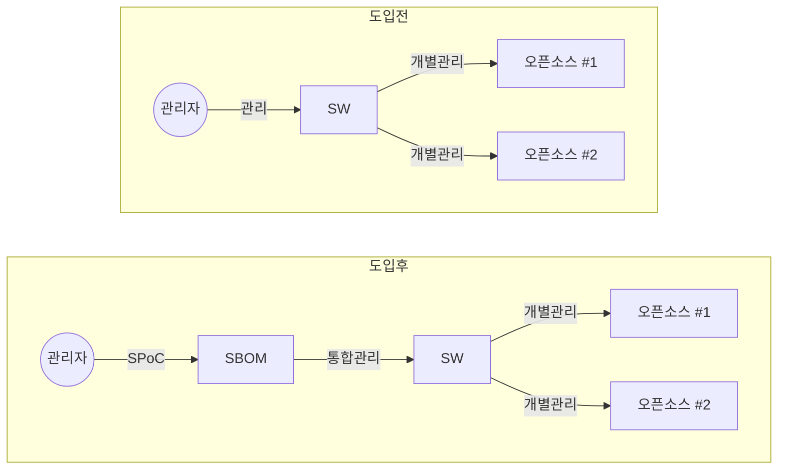

## SBOM의 개념

- SW개발 및 배포 과정에 사용된 모든 오픈소스, 라이브러리, 패키지, 모듈 등의 구성요소를 체계화한 SW자재 명세서
- SW복잡성의 증가로 인한 보안취약점, OSS라이센스 관리, SW공급망 투명성 확보, 구성요소들의 품질 관리를 위해 필요

## SBOM의 개념도, 구성요소, 적용사례

### SBOM의 개념도

- SBOM 도입으로 관리자가 SW를 통합 관리 가능

### SBOM의 구성요소

| 구분 | 내용 | 비고 |
| --- | --- | --- |
| 지침, 절차 | SBOM 요청, 생성, 사용에 관한 절차 정의 | 생성 빈도, 분석 깊이, 접근 제어 등 |
| 컴포넌트 명세 | 추적해야할 각 컴포넌트의 식별정보, 관계정보 | 이름, 버전, 고유식별자, 의존관계, 라이센스 |
| 자동화 지원 | 기계 가독성 데이터포맷으로 자동화된 추적관리 | SPDX, CycloneDX 등 SBOM 프로토콜 |

### SBOM 적용사례

| 구분 | 사례 | 비고 |
| --- | --- | --- |
| 국내 | 디지털 플랫폼 정부 | SW공급망 보안 가이드라인 |
| 국외 | 바이든 행정부 | 행정명령 통한 주요 인프라SW SBOM 의무화 |
| - | 리눅스 재단 | SPDX 표준 관리 통한 SBOM 정보 교환 및 활용 지원 |
| - | EU | 사이버복원력법 제정, 유통되는 모든 디지털 기기의 SBOM 의무화 |

## SBOM 도입 후 고려사항

- SW구성요소 변경시 SBOM을 최신상태로 유지하여 정보 정확성을 확보하고, 주기적인 오픈소스 버전 업데이트로 보안 취약점 개선

## 참조

- [KISA: SW 공급망 보안 가이드라인 1.0](https://www.kisa.or.kr/2060204/form?postSeq=15&page=1)
